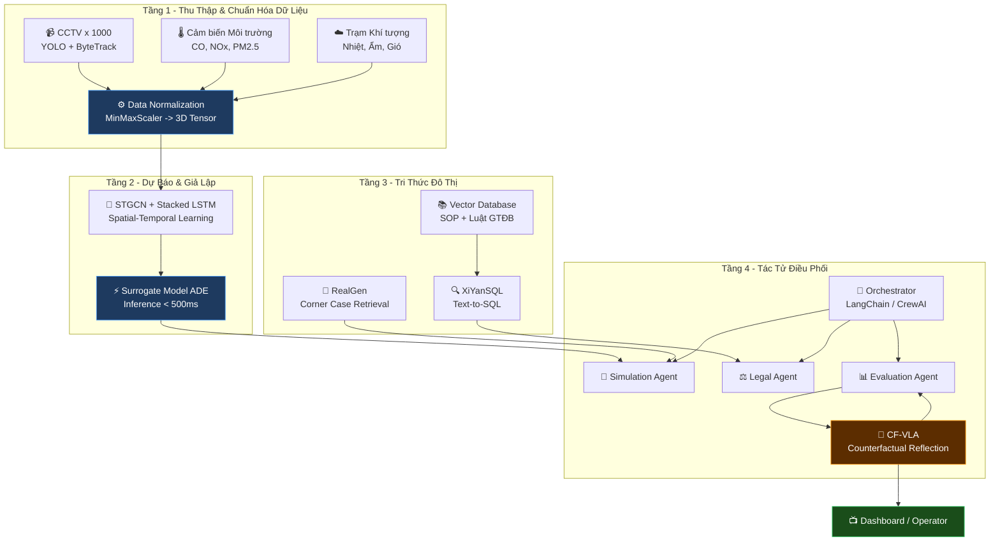
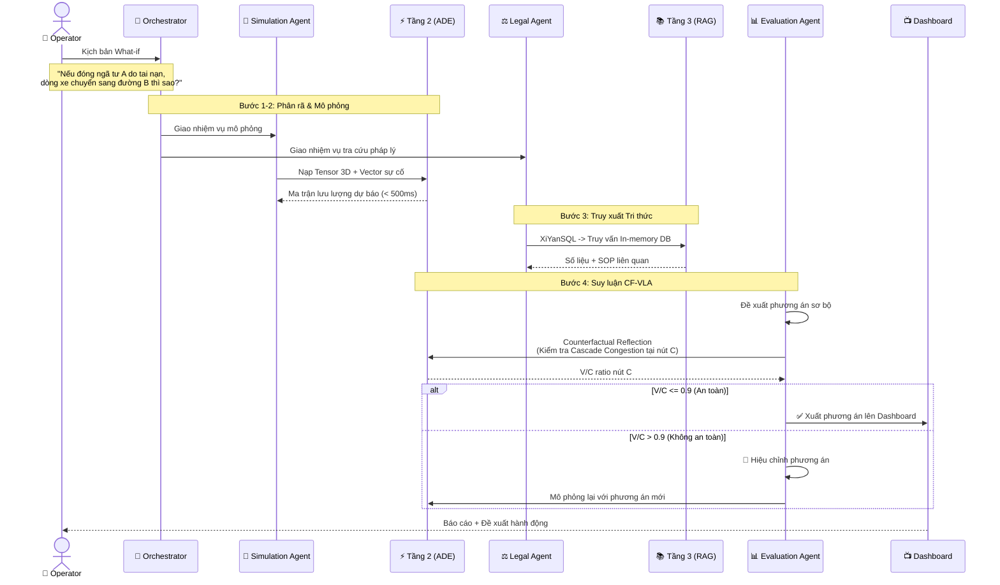

# 🚦 STWI — TÀI LIỆU TỔNG HỢP & QUY CHUẨN DỰ ÁN

| Thuộc tính | Giá trị |
|---|---|
| **Dự án** | SmartTraffic What-If (STWI) |
| **Mã tài liệu** | STWI-DOC-00 |
| **Phiên bản** | 1.1 |
| **Ngày tạo** | 15/06/2026 |
| **Cập nhật lần cuối** | 15/06/2026 |
| **Trạng thái** | 📝 Đang soạn thảo (Draft) |
| **Phân loại** | Tài liệu nội bộ — Báo cáo tiến độ |

> [!NOTE]
> Đây là tài liệu "Kim chỉ nam" tóm tắt bức tranh toàn cảnh về kiến trúc, luồng xử lý và các quy chuẩn phát triển (Rules) bắt buộc tuân theo cho toàn bộ đội ngũ lập trình và vận hành dự án STWI.

---

## Mục lục

- [1. Tổng hợp Kiến trúc Hệ thống](#1-tổng-hợp-kiến-trúc-hệ-thống)
- [2. Quy trình Luồng Xử lý (Workflow Pipeline)](#2-quy-trình-luồng-xử-lý-workflow-pipeline)
- [3. Các Quy chuẩn Kỹ thuật Bắt buộc](#3-các-quy-chuẩn-kỹ-thuật-bắt-buộc)
- [4. Tài liệu Tham khảo](#4-tài-liệu-tham-khảo)
- [Phụ lục: Lịch sử Phiên bản](#phụ-lục-lịch-sử-phiên-bản)

---

## 1. Tổng hợp Kiến trúc Hệ thống

Hệ thống STWI được cấu trúc thành **4 phân tầng (Tiers)** tương tác chặt chẽ tạo thành một chu trình khép kín, chuyển hóa từ Dữ liệu thô (Raw Data) -> Dự báo số liệu (Prediction) -> Tri thức pháp lý (Legal Knowledge) -> Hành động điều phối (Action).

### Sơ đồ Kiến trúc Tổng quan

### Mô tả từng Tầng

| Tầng | Tên gọi | Mô tả ngắn gọn | Tài liệu chi tiết |
|------|---------|-----------------|---------------------|
| **1** | Thu Thập & Chuẩn Hóa Dữ Liệu | Thu thập từ Camera CCTV (YOLO, ByteTrack) và Cảm biến. Chuẩn hóa thành `3D Tensor` chứa lịch sử 60 phút. | [📄 01_System_Architecture](./01_System_Architecture_Data_Pipeline.md) |
| **2** | Dự Báo & Giả Lập | Kiến trúc lai `STGCN + Stacked LSTM` cho đặc trưng Không gian-Thời gian. Surrogate Model `ADE` giả lập kịch bản với tốc độ < 500ms. | [📄 02_ML_and_Simulation](./02_ML_and_Simulation_Specification.md) |
| **3** | Tri Thức Đô Thị (RAG) | Vector Database lưu trữ SOP & Luật GTĐB. `XiYanSQL` chuyển text -> SQL truy vấn số liệu. `RealGen` tái tạo kịch bản biên. | [📄 03_Knowledge_Base_RAG](./03_Knowledge_Base_and_RAG_Design.md) |
| **4** | Tác Tử Điều Phối | Khung `Multi-Agent` với 3 tác tử con. Lõi suy luận `CF-VLA` tự phản biện trước khi hành động. | [📄 04_AI_Agent_CF-VLA](./04_AI_Agent_Orchestrator_CF_VLA.md) |

---

## 2. Quy trình Luồng Xử lý (Workflow Pipeline)

Quy trình End-to-End từ khi Người điều hành (Operator) nhập một kịch bản "What-if" cho đến khi xuất báo cáo hành động:

### Sơ đồ Luồng Xử lý

### Mô tả chi tiết từng Bước

| Bước | Tên gọi | Mô tả |
|------|---------|-------|
| **1** | Tiếp nhận & Phân rã | Operator nhập kịch bản. Orchestrator phân tích và giao việc cho Simulation Agent & Legal Agent. |
| **2** | Xử lý Số liệu | Simulation Agent kích hoạt Tầng 2. Nạp dữ liệu hiện tại (Tensor 3D) + Vector sự cố. Surrogate Model dự báo và đẩy kết quả vào In-memory DB. |
| **3** | Truy xuất Tri thức | Legal Agent dùng `XiYanSQL` truy vấn số liệu từ In-memory DB. Đồng thời search Vector DB lấy SOP quy định xử lý sự cố. |
| **4** | Suy luận CF-VLA | Evaluation Agent đề xuất phương án -> Kích hoạt phản biện Counterfactual -> Kiểm tra Cascade Congestion tại các nút lân cận. |
| **5** | Xuất Báo cáo | Nếu V/C <= 0.9: xuất phương án lên Dashboard. Nếu V/C > 0.9: vòng lặp quay lại Bước 4 để hiệu chỉnh. |

---

## 3. Các Quy chuẩn Kỹ thuật Bắt buộc

> [!CAUTION]
> Toàn bộ code và thiết kế hệ thống **PHẢI** tuân thủ nghiêm ngặt các quy chuẩn dưới đây. Vi phạm bất kỳ quy chuẩn nào đều yêu cầu review lại bởi Hội đồng Kiến trúc.

### 3.1. Quy chuẩn Độ trễ (Latency Limits)

| Chỉ số | Ngưỡng bắt buộc | Ghi chú |
|--------|------------------|---------|
| Tổng thời gian phản hồi End-to-End | **< 3 phút** | Từ khi nhận câu lệnh What-if -> Xuất báo cáo |
| Thời gian suy luận lõi AI (TTP) | **< 500ms** | Tầng 2 — Surrogate Model inference, đo tại P99 |

### 3.2. Quy chuẩn Dữ liệu (Data Integrity)

| Quy tắc | Chi tiết |
|---------|----------|
| Chuẩn hóa | Toàn bộ pipeline tiền xử lý phải qua `MinMaxScaler` đưa features về dải `(0, 1)` |
| Input Tensor Shape | Bắt buộc: `[Batch Size, 12, 14]` — 12 Time Steps x 14 Features |
| Thay đổi cấu trúc | Mọi thay đổi shape Tensor phải thông qua Hội đồng Kiến trúc phê duyệt |

### 3.3. Quy chuẩn An toàn Điều phối (CF-VLA Enforcements)

> [!WARNING]
> **KHÔNG BAO GIỜ** được bypass (bỏ qua) luồng tự phản biện Counterfactual. Đây là lớp an toàn cuối cùng trước khi đưa ra đề xuất cho Operator.

- Phương án đầu ra (Final Action) chỉ được chấp thuận nếu tỷ lệ **V/C (Volume / Capacity)** tại **tất cả** các nút lân cận sau khi phân luồng nhỏ hơn **`0.9`** (ngưỡng an toàn).
- Nếu vượt ngưỡng, hệ thống phải tự động kích hoạt vòng lặp hiệu chỉnh.

### 3.4. Quy chuẩn Tri thức (No-Hallucination Policy)

> [!IMPORTANT]
> Mọi đề xuất của Agent phải có căn cứ pháp lý. Tuyệt đối không chấp nhận "sáng tạo" thiếu kiểm chứng.

- Các đề xuất phân luồng/can thiệp giao thông **phải đi kèm Trích dẫn căn cứ pháp lý** (Legal Grounding) — Ví dụ: *Dựa trên khoản X Điều Y, hoặc theo SOP số Z*.
- Agent **không được phép** tự bịa (hallucinate) quyền hạn điều phối nếu chưa tham chiếu qua Tầng 3 (RAG).
- Mọi phương án "sáng tạo" ngoài SOP phải được dán nhãn: **`[⚠️ CẢNH BÁO — CHƯA KIỂM CHỨNG]`**

---

## 4. Tài liệu Tham khảo

| # | Tài liệu | Đường dẫn |
|---|----------|-----------|
| 1 | Kiến trúc Hệ thống & Data Pipeline | [01_System_Architecture_Data_Pipeline.md](./01_System_Architecture_Data_Pipeline.md) |
| 2 | Đặc tả Mô hình ML & Mô phỏng | [02_ML_and_Simulation_Specification.md](./02_ML_and_Simulation_Specification.md) |
| 3 | Thiết kế Cơ sở Tri thức & RAG | [03_Knowledge_Base_and_RAG_Design.md](./03_Knowledge_Base_and_RAG_Design.md) |
| 4 | Đặc tả Tác tử AI & CF-VLA | [04_AI_Agent_Orchestrator_CF_VLA.md](./04_AI_Agent_Orchestrator_CF_VLA.md) |
| 5 | Bản Idea Plan gốc (Blueprint) | [gemini-code-1781508694335.md](./gemini-code-1781508694335.md) |

---

## Phụ lục: Lịch sử Phiên bản

| Phiên bản | Ngày | Tác giả | Mô tả thay đổi |
|-----------|------|---------|-----------------|
| 1.0 | 15/06/2026 | Nhóm STWI | Soạn thảo ban đầu |
| 1.1 | 15/06/2026 | Nhóm STWI | Chuẩn hóa format doanh nghiệp, sửa lỗi Mermaid render, bỏ rect blocks trong sequence diagram |
