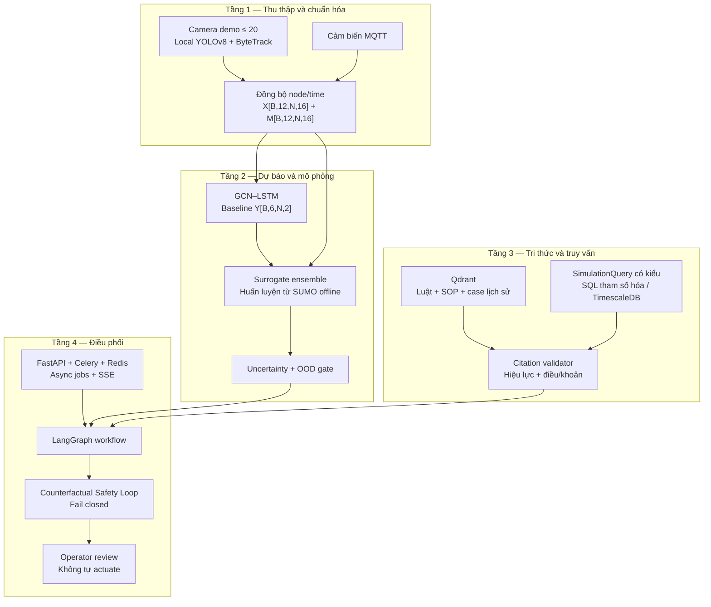
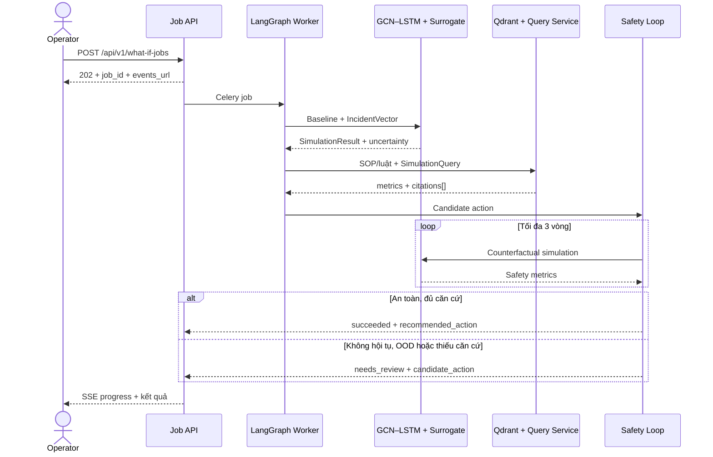

# 🚦 STWI — TÀI LIỆU TỔNG HỢP & QUY CHUẨN DỰ ÁN

| Thuộc tính | Giá trị |
|---|---|
| **Dự án** | SmartTraffic What-If (STWI) |
| **Mã tài liệu** | STWI-DOC-00 |
| **Phiên bản** | 1.4 |
| **Ngày tạo** | 15/06/2026 |
| **Cập nhật lần cuối** | 21/06/2026 |
| **Trạng thái** | 📝 Đang soạn thảo (Draft) |
| **Phân loại** | Tài liệu nội bộ — Nguồn sự thật kiến trúc |

> [!IMPORTANT]
> Tài liệu này và [`project_contract.json`](../project_contract.json) là nguồn sự thật của MVP. Báo cáo LaTeX, slides và release notes phải tuân theo các hợp đồng tại đây.

## 1. Mục tiêu và phạm vi MVP

STWI là hệ thống **hỗ trợ ra quyết định**, chuyển câu hỏi What-if của người vận hành thành dự báo định lượng, căn cứ pháp lý và một phương án để con người xem xét. MVP không tự điều khiển đèn tín hiệu hoặc thiết bị hiện trường.

| Hạng mục | Phạm vi 13 tuần |
|---|---|
| Mạng chức năng | 20 node, tối đa 20 luồng camera ghi sẵn/RTSP |
| Kiểm thử quy mô | 1.000 producer tổng hợp gửi bản ghi đã trích xuất; không xử lý thật 1.000 video stream |
| Dữ liệu hình ảnh | Xử lý tại biên; không lưu hoặc phát hành video thô |
| Đầu ra | Khuyến nghị cho operator; luôn cần phê duyệt thủ công |
| Hiệu năng | Surrogate P99 < 500 ms; E2E P95 ≤ 30 giây; hard deadline/P99 ≤ 180 giây |

## 2. Kiến trúc bốn tầng

| Tầng | Trách nhiệm | Tài liệu chi tiết |
|---|---|---|
| 1 | Chuyển dữ liệu camera/cảm biến thành tensor theo node, thời gian và missing mask | [STWI-DOC-01](./01_System_Architecture_Data_Pipeline.md) |
| 2 | Dự báo baseline bằng GCN–LSTM; mô phỏng kịch bản bằng surrogate ensemble | [STWI-DOC-02](./02_ML_and_Simulation_Specification.md) |
| 3 | Truy xuất luật/SOP có phiên bản và truy vấn số liệu qua schema có kiểu | [STWI-DOC-03](./03_Knowledge_Base_and_RAG_Design.md) |
| 4 | Chạy workflow bất đồng bộ, phản biện an toàn và chuyển operator duyệt | [STWI-DOC-04](./04_AI_Agent_Orchestrator_CF_VLA.md) |

## 3. Luồng xử lý E2E

## 4. Hợp đồng bất biến

### 4.1. Dữ liệu

| Hợp đồng | Giá trị |
|---|---|
| Input | `X[B,12,N,16]` — batch × 12 bước × node × 16 features |
| Missing mask | `M[B,12,N,16]`, 1 nếu quan sát thật, 0 nếu thiếu/imputed |
| Graph | `A[N,N]` với node order cố định theo `node_registry` |
| Baseline output | `Y[B,6,N,2]`: `traffic_volume_5m`, `avg_speed_kmh` |
| V/C | Tính xác định từ lưu lượng dự báo và capacity có phiên bản của node |
| Scaling | Chỉ fit/scale feature liên tục trên training split; không scale cyclical/ratio |

### 4.2. An toàn và pháp lý

1. **Counterfactual Safety Loop** lấy cảm hứng từ CF-VLA nhưng không được mô tả như mô hình VLA end-to-end.
2. Ngưỡng V/C mặc định `0.9` là policy cấu hình, không phải quy định pháp luật.
3. Không hội tụ, OOD, uncertainty cao hoặc thiếu citation hợp lệ đều phải **fail closed**.
4. `succeeded` mới được có `recommended_action`; `needs_review` chỉ có `candidate_action`.
5. Mọi citation phải chỉ rõ văn bản, điều/khoản, URL nguồn, thời gian hiệu lực và trạng thái thay thế.
6. Operator phải phê duyệt; MVP không gửi lệnh điều khiển ra thiết bị hiện trường.

### 4.3. Quan sát và bảo mật

- Mọi job có `job_id`, `trace_id`, model/data version và audit trail.
- SQL chỉ được tạo từ `SimulationQuery` đã validate, tham số hóa và chạy bằng read-only role.
- Văn bản truy xuất được xem là dữ liệu không tin cậy; prompt injection không được phép thay đổi policy hệ thống.
- Chỉ lưu aggregate camera; không lưu video thô trong MVP.

## 5. Nguồn pháp lý tối thiểu

- [Luật Đường bộ số 35/2024/QH15](https://vanban.chinhphu.vn/?pageid=27160&docid=211193), hiệu lực 01/01/2025.
- [Luật Trật tự, an toàn giao thông đường bộ số 36/2024/QH15](https://vanban.chinhphu.vn/?pageid=27160&docid=211194&classid=1&typegroupid=3), hiệu lực 01/01/2025.
- SOP được cơ quan vận hành phê duyệt và các nghị định/thông tư còn hiệu lực có liên quan.

## 6. Tài liệu tham khảo

| Tài liệu | Vai trò |
|---|---|
| [`project_contract.json`](../project_contract.json) | Hợp đồng máy đọc được cho validator và CI |
| [STWI-DOC-01](./01_System_Architecture_Data_Pipeline.md) | Data pipeline |
| [STWI-DOC-02](./02_ML_and_Simulation_Specification.md) | ML và surrogate |
| [STWI-DOC-03](./03_Knowledge_Base_and_RAG_Design.md) | RAG, legal corpus và query |
| [STWI-DOC-04](./04_AI_Agent_Orchestrator_CF_VLA.md) | Orchestrator và safety loop |
| [STWI-DOC-05](./05_Implementation_Plan.md) | Kế hoạch 13 tuần |

## Phụ lục: Lịch sử phiên bản

| Phiên bản | Ngày | Tác giả | Mô tả thay đổi |
|---|---|---|---|
| 1.0 | 15/06/2026 | Nhóm STWI | Soạn thảo ban đầu |
| 1.1 | 15/06/2026 | Nhóm STWI | Chuẩn hóa format và Mermaid |
| 1.2 | 20/06/2026 | Nhóm STWI | Cụ thể hóa stack và fallback |
| 1.3 | 20/06/2026 | Nhóm STWI | Mở rộng 16 features và đơn giản hóa Text-to-SQL |
| 1.4 | 21/06/2026 | Nhóm STWI | Chốt MVP 13 tuần, tensor 4D có node axis, GCN–LSTM, async API, citation có cấu trúc và Counterfactual Safety Loop fail-closed |
