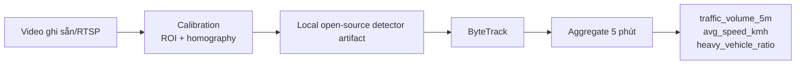

# 🚦 STWI — Tài liệu Đặc tả Kỹ thuật (Phần 1)

## Kiến trúc Hệ thống & Luồng Dữ liệu

| Thuộc tính | Giá trị |
|---|---|
| **Dự án** | SmartTraffic What-If (STWI) |
| **Mã tài liệu** | STWI-DOC-01 |
| **Phiên bản** | 1.4 |
| **Ngày tạo** | 15/06/2026 |
| **Cập nhật lần cuối** | 21/06/2026 |
| **Trạng thái** | 📝 Đang soạn thảo (Draft) |
| **Phân loại** | Tài liệu nội bộ — Đặc tả kỹ thuật |

> [!NOTE]
> Tài liệu này đặc tả Tầng 1 và hợp đồng dữ liệu đưa vào GCN–LSTM. Giá trị chuẩn được phản chiếu trong [`project_contract.json`](../project_contract.json).

## 1. Phạm vi MVP

- Chạy chức năng trên mạng 20 node và tối đa 20 video ghi sẵn/RTSP.
- Kiểm thử ingestion ở quy mô 1.000 camera bằng producer tổng hợp gửi aggregate 5 phút.
- Không tuyên bố inference thị giác đồng thời trên 1.000 video stream.
- Video được xử lý tại biên; chỉ aggregate và audit metadata được truyền/lưu.

### 1.1. Chế độ simulation-first cho demo cá nhân

Khi không có phần cứng hiện trường, dữ liệu cảm biến thật hoặc RTSP hợp lệ,
demo được phép dùng dataset tổng hợp có version với phân loại
`synthetic_simulation_demo_only`. Chế độ này giữ nguyên mạng 20 node, tensor,
missing mask, API và safety contract, nhưng không được dùng để tuyên bố độ chính
xác production, calibration hiện trường hoặc dữ liệu cảm biến thật.

Baseline forecast dùng time-series tổng hợp 5 phút từ generator có seed và
provenance. Surrogate dùng các lượt chạy Eclipse SUMO offline. Ảnh/frame dùng
để huấn luyện detector không phải chuỗi quan sát giao thông; chúng không được
đưa trực tiếp vào GCN–LSTM hoặc dùng để suy ra tốc độ khi thiếu tracking và
homography. Trong demo, camera không đủ gate phải hiển thị `degraded` hoặc
`simulation_only` thay vì phát hành aggregate hợp lệ giả.

## 2. Thu thập dữ liệu

### 2.1. CCTV



| Yêu cầu | Quy tắc |
|---|---|
| Đếm xe | Theo line-crossing/ROI đã hiệu chỉnh, chống đếm lặp bằng track ID |
| Tốc độ | Chỉ tính khi camera có homography hoặc hệ số hiệu chỉnh được phê duyệt |
| Phân loại | Gom nhóm xe nặng: tải và buýt |
| Privacy | Không lưu frame/clip mặc định; log chỉ chứa camera ID, model version và quality metrics |
| Model artifact | Local open-source detector là đường chính; artifact phải có source model/license, checksum, class map, thresholds, metrics và privacy review |
| Offline | Sau 15 phút không có aggregate hợp lệ, đánh dấu source offline |

### 2.1.1. Local open-source detector và calibration

Dataset ảnh tải từ Roboflow hoặc nguồn bổ sung được xem là dữ liệu validation/calibration offline cho detector Tầng 1 trước, và là dữ liệu fine-tune fallback chỉ khi detector pretrained không đạt gate. Runtime không phụ thuộc Roboflow. Export chuẩn là YOLO/Ultralytics với `data.yaml`, `train/images`, `train/labels`, `valid/images`, `valid/labels`, `test/images`, `test/labels`; `scripts/prepare_roboflow_yolo_dataset.py` sinh `dataset.yaml` và `dataset_manifest.json` cho STWI.

| Hướng dẫn | Giá trị |
|---|---|
| Raw export/cache | `data/external/roboflow/` |
| Private training dataset | `data/derived/private/vision_training/roboflow_v001` |
| Vehicle-only dataset | `data/derived/private/vision_training/roboflow_v001_stwi_vehicles_short` |
| Training output | `data/derived/private/vision_runs/` |
| Script prepare | `python scripts/prepare_roboflow_yolo_dataset.py data/derived/private/vision_training/roboflow_v001 --dataset-version roboflow_v001` |
| Script vehicle remap | `python scripts/build_stwi_vehicle_yolo_dataset.py data/derived/private/vision_training/roboflow_v001 data/derived/private/vision_training/roboflow_v001_stwi_vehicles_short` |
| Script validate | `python scripts/validate_vision_dataset.py data/derived/private/vision_training/roboflow_v001` |
| Script evaluate pretrained | `python scripts/evaluate_vision_roi_ap.py --source data/derived/private/vision_training/roboflow_v001 --model yolo11s.pt --model-family yolo` |
| Script fine-tune fallback | `python scripts/train_vision_model.py --dataset data/derived/private/vision_training/roboflow_v001 --model yolo11s.pt` |
| Script promote | `python scripts/promote_vision_model.py data/derived/private/vision_runs/<run>/stwi_model_artifact.json --approver <reviewer> --notes <decision>` |

Quy tắc bắt buộc:

1. Dataset và run output ở các thư mục private/ignored; không commit ảnh, weight `.pt`, zip dataset, signed URL hoặc manifest chứa secret.
2. `dataset_manifest.json` ghi source workspace/project/version, format, license/usage note, checksum, split count, class map, image/label records và privacy review.
3. Class map phải quy về nhóm STWI tối thiểu: `car`, `motorcycle`, `bus`, `truck`; các class không ánh xạ phải bị bỏ qua hoặc ghi rõ trong metrics.
4. Chỉ promote detector khi validation/test metrics, latency, threshold/ROI policy, source license và privacy review đã được ghi; thiếu review thì chỉ được dùng cho thử nghiệm cục bộ.
5. Detector failure, low confidence, calibration hết hạn hoặc frame OOD phải đánh dấu degraded/offline; không phát hành aggregate hợp lệ giả.
6. Output detector chỉ là evidence cho aggregate 5 phút: `traffic_volume_5m`, `avg_speed_kmh`, `heavy_vehicle_ratio`.

### 2.1.2. Optional Roboflow workflow inference

MVP can call the Roboflow workflow `STWI Traffic Unified Phase 2 v1 Logic` for
single permitted frames/images when hosted detection is explicitly needed. This
is an optional adapter, not the primary deployment path. The integration code
lives in `stwi.t1_pipeline.roboflow_workflow` and reads the API key from
`ROBOFLOW_API_KEY`.

| Field | Value |
|---|---|
| Workspace | `lymphaticvesselsegmentation` |
| Workflow id | `stwi-traffic-unified-phase-2-v1-logic` |
| Endpoint | `https://serverless.roboflow.com` via `InferenceHTTPClient` |
| Input | `image` (`https://` URL or base64) |
| Output | From the workflow definition; currently `predictions` |

Safety rules:

1. Call the workflow only for frames/images approved for processing; do not store raw video.
2. Do not log API keys, sensitive signed URLs, image base64, or image-shaped response payloads.
3. Treat detector output only as evidence for five-minute aggregates, never as a control decision.
4. On workflow timeout/error/OOD, fail closed: do not publish a valid aggregate and mark quality degraded/offline according to policy.

### 2.2. Cảm biến và đồng bộ node

Cảm biến gửi MQTT bằng schema có version. Mỗi trạm được ánh xạ tới một hoặc nhiều node qua `sensor_node_map`; bản ghi phải có `source_id`, `observed_at`, `received_at`, unit và quality flag.

| Nhóm | Feature | Đơn vị |
|---|---|---|
| Khí thải | `co_ppm`, `co2_ppm`, `nox_ppb`, `pm25_ugm3`, `pm10_ugm3` | ppm, ppb, µg/m³ |
| Khí tượng | `temperature_c`, `humidity_pct`, `wind_speed_ms` | °C, %, m/s |
| Tín hiệu | `green_time_ratio` | Tỷ lệ thời gian đèn xanh trong cửa sổ 5 phút |

> [!IMPORTANT]
> `green_time_ratio` thay cho trạng thái đèn tức thời. Một bit "đang xanh" không đại diện được chu kỳ tín hiệu trong aggregate 5 phút.

## 3. Hợp đồng tensor

### 3.1. Shape và trục

```
X = [Batch, HistorySteps, Nodes, Features] = [B, 12, N, 16]
M = [Batch, HistorySteps, Nodes, Features] = [B, 12, N, 16]
A = [Nodes, Nodes] = [N, N]
```

| Trục | Ý nghĩa |
|---|---|
| `B` | Số cửa sổ mạng trong batch; không phải số camera |
| `12` | 60 phút lịch sử, mỗi bước 5 phút |
| `N` | Số node theo thứ tự bất biến trong `node_registry` |
| `16` | Số feature trên mỗi node |
| `M` | 1 nếu quan sát thật, 0 nếu thiếu hoặc được impute |
| `A` | Adjacency có cùng node order với `X` |

### 3.2. Danh sách 16 features

| # | Tên chuẩn | Đơn vị | Encoding |
|---|---|---|---|
| 1 | `traffic_volume_5m` | vehicles/5min | scaled continuous |
| 2 | `avg_speed_kmh` | km/h | scaled continuous |
| 3 | `heavy_vehicle_ratio` | [0,1] | bounded ratio |
| 4 | `co_ppm` | ppm | scaled continuous |
| 5 | `co2_ppm` | ppm | scaled continuous |
| 6 | `nox_ppb` | ppb | scaled continuous |
| 7 | `pm25_ugm3` | µg/m³ | scaled continuous |
| 8 | `pm10_ugm3` | µg/m³ | scaled continuous |
| 9 | `temperature_c` | °C | scaled continuous |
| 10 | `humidity_pct` | % | scaled continuous |
| 11 | `wind_speed_ms` | m/s | scaled continuous |
| 12 | `time_of_day_sin` | [-1,1] | cyclical |
| 13 | `time_of_day_cos` | [-1,1] | cyclical |
| 14 | `day_of_week_sin` | [-1,1] | cyclical |
| 15 | `day_of_week_cos` | [-1,1] | cyclical |
| 16 | `green_time_ratio` | [0,1] | bounded ratio |

### 3.3. Chuẩn hóa và missing data

1. Fit scaler **chỉ trên training split theo thời gian**.
2. Chỉ transform 10 feature `scaled_continuous` theo `project_contract.json`; giữ nguyên 4 feature cyclical và 2 feature ratio.
3. Outlier không bị clamp im lặng: giữ quality flag, thay bằng giá trị đã impute nếu vượt hard sanity bound.
4. Thiếu ≤ 15 phút: forward/interpolate theo feature; thiếu lâu hơn: ưu tiên node lân cận rồi population median.
5. Mọi giá trị impute phải có `M=0`; model và metrics phải báo tỷ lệ missing.
6. Scaler, node registry, feature order và capacity table đều có version trong model artifact.

### 3.4. Ví dụ PyTorch-like

```python
import torch

B, T, N, F = 32, 12, 20, 16
X = torch.rand(B, T, N, F)
M = torch.ones(B, T, N, F, dtype=torch.bool)
A = torch.eye(N)

assert X.shape == (32, 12, 20, 16)
assert M.shape == X.shape
assert A.shape == (20, 20)
```

## 4. Validation và observability

| Kiểm tra | Hành động |
|---|---|
| Sai schema/version/unit | Reject record; đưa vào dead-letter queue |
| Timestamp lệch quá tolerance | Reject hoặc gắn `late_event` |
| Node/source không tồn tại | Reject và cảnh báo cấu hình |
| Thiếu dữ liệu dài | Impute + `M=0` + degraded quality |
| Camera calibration hết hạn | Không phát hành speed; vẫn có volume nếu hợp lệ |
| Video thô xuất khỏi edge | Fail privacy check |

Metrics bắt buộc: ingest lag, valid-record ratio, missing ratio theo feature/node, camera FPS, track quality, calibration age và tensor build latency.

## 5. Mock và kiểm thử quy mô

| Generator | Mục đích |
|---|---|
| `MockNetworkGenerator` | Mạng 20 node, adjacency và capacity có version |
| `MockCCTVAggregateProducer` | Pattern sáng/chiều, sự cố và quality flags |
| `MockSensorProducer` | MQTT messages có missing/outlier/late events |
| `LoadProducer1000` | 1.000 nguồn aggregate để kiểm thử ingestion, không phải video inference |
| `MockTensorBuilder` | Sinh `X[B,12,N,16]`, `M[B,12,N,16]`, `A[N,N]` |

## Phụ lục: Lịch sử phiên bản

| Phiên bản | Ngày | Tác giả | Mô tả |
|---|---|---|---|
| 1.0 | 15/06/2026 | Nhóm STWI | Soạn thảo ban đầu |
| 1.1 | 15/06/2026 | Nhóm STWI | Chuẩn hóa format |
| 1.2 | 20/06/2026 | Nhóm STWI | Validation, MQTT và mock data |
| 1.3 | 20/06/2026 | Nhóm STWI | Cyclical encoding đầy đủ |
| 1.4 | 21/06/2026 | Nhóm STWI | Bổ sung node axis và missing mask, chuẩn hóa unit/feature, đổi tín hiệu sang green-time ratio, giới hạn camera MVP và privacy |
