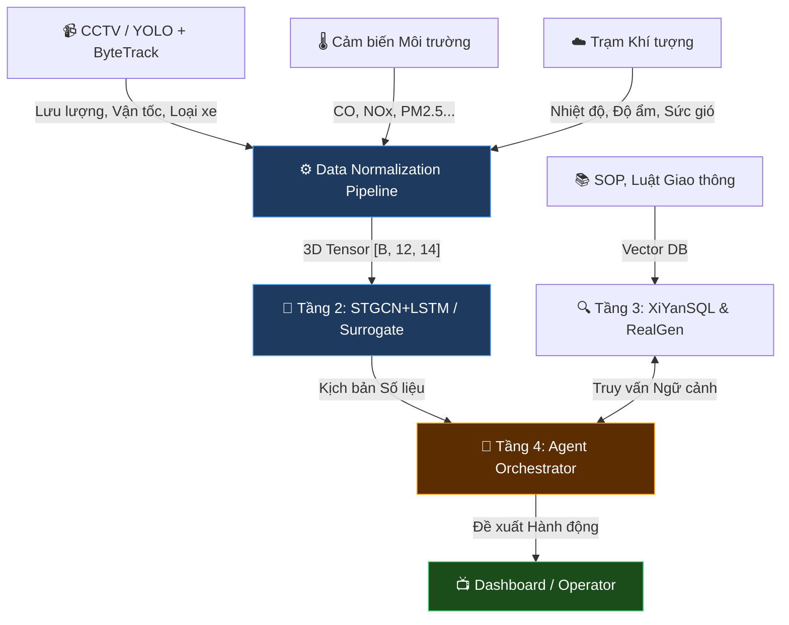
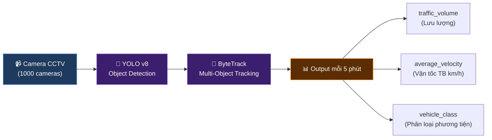

# 🚦 STWI — Tài liệu Đặc tả Kỹ thuật (Phần 1)

## Kiến trúc Hệ thống & Luồng Dữ liệu

| Thuộc tính | Giá trị |
|---|---|
| **Dự án** | SmartTraffic What-If (STWI) |
| **Mã tài liệu** | STWI-DOC-01 |
| **Phiên bản** | 1.1 |
| **Ngày tạo** | 15/06/2026 |
| **Cập nhật lần cuối** | 15/06/2026 |
| **Tác giả** | Nhóm Nghiên cứu STWI |
| **Trạng thái** | 📝 Đang soạn thảo (Draft) |
| **Phân loại** | Tài liệu nội bộ — Đặc tả kỹ thuật |

> [!NOTE]
> Tài liệu này đặc tả chi tiết **Tầng 1 — Thu thập & Chuẩn hóa Dữ liệu (Data Pipeline)** và cung cấp bức tranh tổng thể về kiến trúc 4 tầng của dự án STWI.

---

## Mục lục

- [1. Bức Tranh Tổng Thể (System Overview)](#1-bức-tranh-tổng-thể-system-overview)
- [2. Đặc tả Tầng Thu thập Dữ liệu Đa phương thức](#2-đặc-tả-tầng-thu-thập-dữ-liệu-đa-phương-thức-data-pipeline)
  - [2.1. Phân hệ Thị giác Máy tính (CCTV Pipeline)](#21-phân-hệ-thị-giác-máy-tính-cctv-pipeline)
  - [2.2. Phân hệ Cảm biến Môi trường & Khí tượng](#22-phân-hệ-cảm-biến-môi-trường--khí-tượng)
- [3. Cấu trúc và Chuẩn hóa Dữ liệu](#3-cấu-trúc-và-chuẩn-hóa-dữ-liệu-data-normalization)
- [Phụ lục](#phụ-lục)

---

## 1. Bức Tranh Tổng Thể (System Overview)

Hệ thống STWI hoạt động dựa trên cơ chế **Multi-modal Data Pipeline** (Dòng dữ liệu đa nguồn), tạo thành một vòng lặp khép kín chuyển hóa từ Số liệu (Data) -> Ngôn ngữ tự nhiên (NLP) -> Hành động (Action).

Kiến trúc tổng thể gồm 4 tầng (Tiers) tương tác mật thiết với nhau:

| Tầng | Tên gọi | Chức năng chính |
|------|---------|-----------------|
| **1** | Thu thập & Chuẩn hóa Dữ liệu (Data Pipeline) | Phân tích Camera và Cảm biến -> 3D Tensor |
| **2** | Dự báo Số liệu & Giả lập (Numerical Simulation) | STGCN + LSTM & Surrogate Model |
| **3** | Tri thức Đô thị (RAG) | Vector Database và Schema-Level RAG |
| **4** | Tác tử Điều phối (AI Agent Orchestrator) | Trưởng phòng điều phối ảo & CF-VLA |

### Sơ đồ Kiến trúc Tổng quan



---

## 2. Đặc tả Tầng Thu thập Dữ liệu Đa phương thức (Data Pipeline)

Tầng này có nhiệm vụ **tiếp nhận dữ liệu thời gian thực** từ phần cứng ngoại vi và **đồng bộ hóa** chúng vào một cấu trúc chuẩn.

### 2.1. Phân hệ Thị giác Máy tính (CCTV Pipeline)



| Thông số | Mô tả | Chi tiết |
|----------|--------|----------|
| **Nguồn cấp** | Mạng lưới camera CCTV | 1000 camera tại các giao lộ |
| **Object Detection** | Phát hiện vật thể | `YOLO` (YOLOv8 hoặc tương đương) |
| **Multi-Object Tracking** | Theo dõi đa đối tượng | `ByteTrack` — không đếm trùng phương tiện qua các frame |
| **Chu kỳ xuất** | Tần suất trích xuất | 5 phút/lần |

**Thông số trích xuất:**

| Biến | Tên kỹ thuật | Đơn vị / Mô tả |
|------|-------------|-----------------|
| Lưu lượng | `traffic_volume` | Số lượng phương tiện qua nút giao |
| Vận tốc TB | `average_velocity` | km/h |
| Phân loại | `vehicle_class` | Xe máy, ô tô con, xe tải, xe buýt |

### 2.2. Phân hệ Cảm biến Môi trường & Khí tượng

| Nhóm | Biến đo | Ký hiệu |
|------|---------|---------|
| **Khí thải** | Carbon monoxide | CO |
| | Carbon dioxide | CO₂ |
| | Nitrogen oxides | NOx |
| | Bụi mịn nhỏ | PM₂.₅ |
| | Bụi mịn lớn | PM₁₀ |
| **Khí tượng** | Nhiệt độ | °C |
| | Độ ẩm | % |
| | Tốc độ gió | m/s |

> [!TIP]
> **Logic kỹ thuật đáng chú ý:** Tốc độ gió tỷ lệ nghịch với thời gian lưu giữ bụi mịn tại bề mặt giao lộ. Mô hình cần capture được mối quan hệ **non-linear** này để đánh giá chất lượng không khí khi ùn tắc xảy ra.

---

## 3. Cấu trúc và Chuẩn hóa Dữ liệu (Data Normalization)

Do các nguồn dữ liệu có thang đo khác nhau (ví dụ: nhiệt độ đo bằng °C, lưu lượng lên đến hàng ngàn xe/giờ), tất cả phải đi qua bộ lọc **MinMaxScaler** đưa về khoảng `(0, 1)`.

Dữ liệu sau khi xử lý được đóng gói thành một **Tensor 3 chiều (3D Tensor)** để feed vào mô hình STGCN + LSTM.

### Cấu trúc 3D Tensor

```
Input Shape = [Batch Size, Time Steps, Features]
```

| Chiều | Ý nghĩa | Giá trị mặc định | Ghi chú |
|-------|---------|-------------------|---------|
| **Batch Size** | Số mẫu xử lý đồng thời | `32` hoặc `64` | Tùy thuộc VRAM GPU |
| **Time Steps** | Cửa sổ thời gian (Window Size) | `12` | 12 bước x 5 phút = **60 phút** dữ liệu quá khứ |
| **Features** | Ma trận biến đặc trưng | `14` | Chi tiết bên dưới |

### Chi tiết 14 Biến Đặc trưng (Features)

| Nhóm | Số biến | Chi tiết |
|------|---------|----------|
| Giao thông | 3 | Volume, Velocity, V-Class Ratio |
| Khí thải | 5 | CO, CO₂, NOx, PM₂.₅, PM₁₀ |
| Khí tượng | 3 | Nhiệt độ, Độ ẩm, Tốc độ gió |
| Phụ trợ | 3 | Thời gian trong ngày, Ngày trong tuần, Trạng thái đèn tín hiệu |
| **Tổng** | **14** | |

### Ví dụ Code (PyTorch-like)

```python
import torch

batch_size = 32
time_steps = 12  # 60 phút lịch sử (12 bước x 5 phút)
features = 14    # 14 biến đặc trưng

# Dummy input tensor sau Data Pipeline
input_tensor = torch.rand(batch_size, time_steps, features)

print(f"Data shape ready for simulation tier: {input_tensor.shape}")
# Output: Data shape ready for simulation tier: torch.Size([32, 12, 14])
```

---

## Phụ lục

### Lịch sử Phiên bản

| Phiên bản | Ngày | Tác giả | Mô tả thay đổi |
|-----------|------|---------|-----------------|
| 1.0 | 15/06/2026 | Nhóm STWI | Soạn thảo ban đầu |
| 1.1 | 15/06/2026 | Nhóm STWI | Chuẩn hóa format doanh nghiệp, sửa lỗi Mermaid render, chuyển đổi các công thức và ký hiệu LaTeX sang Unicode |

### Tài liệu Liên quan

- ⬅️ Tài liệu trước: [00_STWI_Summary_and_Guidelines.md](./00_STWI_Summary_and_Guidelines.md)
- ➡️ Tài liệu tiếp: [02_ML_and_Simulation_Specification.md](./02_ML_and_Simulation_Specification.md)
