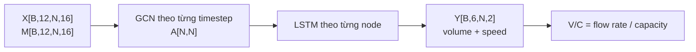
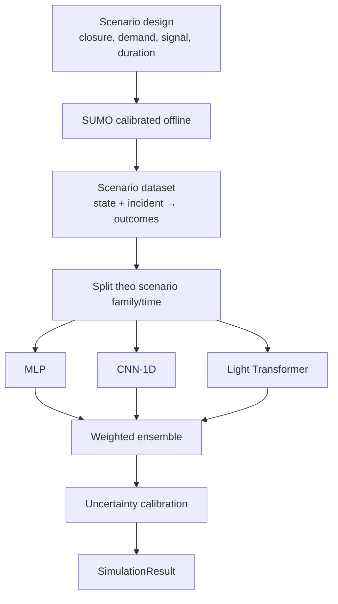

# 🚦 STWI — Tài liệu Đặc tả Kỹ thuật (Phần 2)

## Đặc tả Mô hình Học máy & Mô phỏng

| Thuộc tính | Giá trị |
|---|---|
| **Dự án** | SmartTraffic What-If (STWI) |
| **Mã tài liệu** | STWI-DOC-02 |
| **Phiên bản** | 1.4 |
| **Ngày tạo** | 15/06/2026 |
| **Cập nhật lần cuối** | 21/06/2026 |
| **Trạng thái** | 📝 Đang soạn thảo (Draft) |
| **Phân loại** | Tài liệu nội bộ — Đặc tả kỹ thuật |

> [!NOTE]
> Tầng 2 gồm hai bài toán khác nhau: GCN–LSTM dự báo baseline không can thiệp và surrogate ensemble dự báo tác động của kịch bản What-if.

## 1. GCN–LSTM baseline forecaster

Tên GCN–LSTM phản ánh đúng kiến trúc: graph convolution mã hóa quan hệ không gian tại từng timestep, sau đó LSTM học phụ thuộc thời gian. Đây không được gọi là “STGCN + LSTM”, vì STGCN vốn đã là một kiến trúc spatio-temporal riêng.

| Thành phần | Hợp đồng |
|---|---|
| Input | `X[B,12,N,16]`, `M[B,12,N,16]`, `A[N,N]` |
| GCN | Mã hóa spatial dependency; mask được dùng khi pooling/loss |
| LSTM | 2 lớp là cấu hình khởi đầu, chọn hyperparameter bằng validation |
| Output | `Y[B,6,N,2]` cho 6 horizon × 5 phút |
| Target 1 | `traffic_volume_5m` |
| Target 2 | `avg_speed_kmh` |
| V/C | Tính từ volume dự báo và capacity của node; không coi là target độc lập |

Mạng đường thật có hướng, nhưng GCN MVP sử dụng adjacency trọng số được symmetrize từ travel time/kết nối. Directed routing graph vẫn được giữ riêng cho mô phỏng và giải thích tuyến.

## 2. Dữ liệu, split và baseline

### 2.1. Split chống leakage

- Train/validation/test được chia theo thời gian, không random từng row.
- Scaler chỉ fit trên train.
- Tất cả horizon của cùng một cửa sổ nằm trong cùng split.
- Báo cáo riêng kết quả normal-day, incident và high-missingness.
- Nếu đánh giá khả năng chuyển vùng, giữ một nhóm node làm geographic holdout.

### 2.2. Baseline bắt buộc

| Baseline | Mô tả |
|---|---|
| Persistence | Dùng giá trị timestep gần nhất cho 6 horizon |
| Historical average | Trung bình cùng giờ/ngày trong training set |
| Seasonal linear | Linear/ridge với lag và cyclical features |

Mục tiêu thiết kế là cải thiện ít nhất 20% RMSE so với baseline tốt nhất. Đây là target nghiệm thu; nếu không đạt, MVP phải công bố kết quả baseline thay vì tuyên bố mô hình tốt hơn.

## 3. Surrogate ensemble cho What-if

### 3.1. Vai trò và dữ liệu huấn luyện

Surrogate xấp xỉ kết quả của SUMO cho một trạng thái mạng và một `IncidentVector`. GCN–LSTM cung cấp baseline; surrogate dự báo delta/kết quả sau can thiệp.

`IncidentVector` tối thiểu gồm:

| Trường | Kiểu | Mô tả |
|---|---|---|
| `event_type` | enum | accident, flood, lane_closure, demand_surge, signal_change |
| `affected_node_ids` | list[string] | Node chịu tác động |
| `lane_closure_ratio` | float [0,1] | Tỷ lệ làn bị đóng |
| `demand_multiplier` | float | Hệ số nhu cầu |
| `duration_minutes` | integer | Thời lượng giả định |
| `signal_plan_delta` | object/null | Thay đổi green ratio/offset nếu có |

`SimulationResult` chứa metrics theo node/horizon: volume, speed, V/C, uncertainty; summary chứa network delay, clearance time và max V/C.

### 3.2. Uncertainty và OOD

Variance giữa ba sub-model không tự động là uncertainty đáng tin cậy. Threshold phải được chọn trên held-out validation data bằng prediction-interval coverage và error theo uncertainty bucket.

| Trạng thái | Xử lý |
|---|---|
| Trong distribution, uncertainty đạt ngưỡng | Cho phép chuyển sang Safety Loop |
| Uncertainty cao | Truy xuất case tương tự làm bằng chứng; trạng thái `needs_review` |
| OOD hoặc không có case đủ gần | Fail closed; không sinh `recommended_action` |
| Case lịch sử | Không blend trực tiếp vào online input; chỉ dùng làm evidence hoặc dữ liệu huấn luyện offline |

## 4. Metrics và benchmark

| Nhóm | Metrics |
|---|---|
| Forecast | MAE/RMSE theo target và horizon, congestion F1, error theo node |
| Surrogate | MAE/RMSE so với SUMO, max-V/C error, ranking/action consistency |
| Calibration | Coverage, interval width, error theo uncertainty decile |
| Performance | P50/P95/P99, throughput và GPU memory |
| Data quality | Missing ratio và performance theo missing bucket |

Benchmark chuẩn: 8 CPU cores, 32 GB RAM, NVIDIA GPU 12–16 GB, warm-up cố định, payload 20 node và concurrency được ghi trong report. Surrogate phải đạt P99 < 500 ms trên profile này. Không mô tả inference là O(1); chi phí phụ thuộc N, batch, model và phần cứng.

## 5. Acceptance gates

1. Data contract và node order đúng với DOC-01.
2. Không leakage; scaler/model artifact có version.
3. Forecast được so với cả ba baseline.
4. SUMO dataset có scenario coverage report và calibration record.
5. Uncertainty threshold được cố định trước test.
6. OOD/high uncertainty luôn dẫn đến `needs_review`.
7. P99 < 500 ms trên benchmark profile đã chốt.

## Phụ lục: Lịch sử phiên bản

| Phiên bản | Ngày | Tác giả | Mô tả |
|---|---|---|---|
| 1.0 | 15/06/2026 | Nhóm STWI | Soạn thảo ban đầu |
| 1.1 | 15/06/2026 | Nhóm STWI | Chuẩn hóa format |
| 1.2 | 20/06/2026 | Nhóm STWI | Baseline và surrogate ensemble |
| 1.3 | 20/06/2026 | Nhóm STWI | Cập nhật 16 feature |
| 1.4 | 21/06/2026 | Nhóm STWI | Đổi thành GCN–LSTM, tensor 4D, output hai target, bổ sung SUMO dataset, calibration và OOD fail-closed |

## Phụ lục: Model registry evidence

For the project-native evidence schema covering model version, dataset version,
checksum, metrics, calibration, benchmark profile, threshold, and promotion
decision, see:

- `docs/guides/model_registry_evidence.md` — vision detector, baseline
  forecaster, and surrogate ensemble registry format

This documents the evidence fields STWI should record before promotion or audit;
it does not add MLflow or another registry backend.
