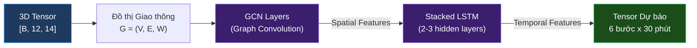
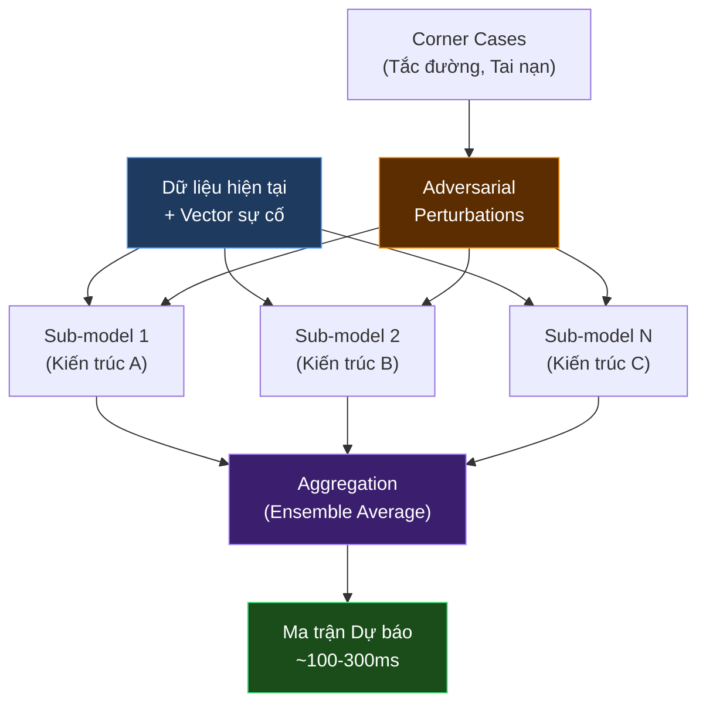

# 🚦 STWI — Tài liệu Đặc tả Kỹ thuật (Phần 2)

## Đặc tả Mô hình Học Máy & Mô phỏng

| Thuộc tính | Giá trị |
|---|---|
| **Dự án** | SmartTraffic What-If (STWI) |
| **Mã tài liệu** | STWI-DOC-02 |
| **Phiên bản** | 1.1 |
| **Ngày tạo** | 15/06/2026 |
| **Cập nhật lần cuối** | 15/06/2026 |
| **Trạng thái** | 📝 Đang soạn thảo (Draft) |
| **Phân loại** | Tài liệu nội bộ — Đặc tả kỹ thuật |

> [!NOTE]
> Tài liệu này đặc tả **Tầng 2 — Lõi AI Dự báo Giao thông**, bao gồm kiến trúc mô hình STGCN + LSTM và Neural Surrogate Model (ADE), được tối ưu hóa để trả về kết quả cho các truy vấn What-if trong thời gian < 500ms.

---

## Mục lục

- [1. Kiến trúc Mô hình Lõi: STGCN + Stacked LSTM](#1-kiến-trúc-mô-hình-lõi-stgcn--stacked-lstm)
  - [1.1. Đồ thị Giao thông](#11-khái-niệm-đồ-thị-giao-thông)
  - [1.2. Lớp GCN](#12-lớp-gcn-graph-convolutional-network)
  - [1.3. Lớp Stacked LSTM](#13-lớp-stacked-lstm)
- [2. Mô hình Thay thế (Neural Surrogate Model)](#2-mô-hình-thay-thế-neural-surrogate-model)
- [3. Pipeline Đánh giá](#3-pipeline-đánh-giá-evaluation-metrics)
- [Phụ lục](#phụ-lục)

---

## 1. Kiến trúc Mô hình Lõi: STGCN + Stacked LSTM

Mô hình học sâu chịu trách nhiệm học sự phụ thuộc **Không gian – Thời gian (Spatio-Temporal)** từ dữ liệu lịch sử giao thông.

### Sơ đồ Kiến trúc Mô hình



### 1.1. Khái niệm Đồ thị Giao thông

Mạng lưới đường phố được mô hình hóa thành **đồ thị có hướng** G = (V, E, W):

| Thành phần | Mô tả |
|------------|-------|
| **Đỉnh (V - Vertices)** | Tập hợp các nút giao thông hoặc đoạn đường gắn camera |
| **Cạnh (E - Edges)** | Các đoạn đường kết nối giữa hai nút |
| **Trọng số (W - Weights)** | Ma trận trọng số tương quan khoảng cách và giới hạn tốc độ |

### 1.2. Lớp GCN (Graph Convolutional Network)

Đảm nhận trích xuất **đặc trưng không gian** — mô hình hóa cách ùn tắc lan truyền qua mạng lưới giao thông.

> [!TIP]
> **Bài toán giải quyết:** Sự ùn tắc ở nút giao A không chỉ ảnh hưởng trực tiếp tới A, mà sẽ lan sang nút B (sau 5 phút) và nút C (sau 10 phút) tùy vào ma trận kề A.

**Công thức cập nhật đặc trưng:**

```
H^(l+1) = σ( D̃^(-1/2) * Ã * D̃^(-1/2) * H^(l) * W^(l) )
```

Trong đó:
- `Ã = A + I_N` — Ma trận kề có bổ sung self-loop (kết nối với chính nó)
- `D̃` — Ma trận bậc (Degree Matrix) của `Ã`
- `H^(l)` — Ma trận đặc trưng tại lớp `l`
- `W^(l)` — Ma trận trọng số học được
- `σ` — Hàm kích hoạt (ví dụ: ReLU)

### 1.3. Lớp Stacked LSTM (Long Short-Term Memory)

Đảm nhận trích xuất **đặc trưng thời gian** từ chuỗi đầu ra của GCN — mô hình hóa tính chu kỳ của dòng xe.

| Thông số | Giá trị | Ghi chú |
|----------|---------|---------|
| **Cấu trúc** | Stacked LSTM | 2–3 hidden layers |
| **Đầu vào** | `[Batch, 12, GCN_Features]` | Đầu ra từ tầng GCN |
| **Đầu ra** | Tensor dự báo 6 bước | 6 x 5 phút = **30 phút tương lai** |
| **Mục đích** | Học tính chu kỳ | Sáng đông -> Trưa vắng -> Chiều kẹt |

---

## 2. Mô hình Thay thế (Neural Surrogate Model)

### Bối cảnh & Động lực

Mô phỏng giao thông vi mô (Micro-simulation như SUMO, Vissim) thường mất **hàng phút đến hàng giờ** để tính toán kịch bản giả định. Do yêu cầu hệ thống trả kết quả trong **dưới 3 phút** (lõi AI cần < 500ms), một mô hình Surrogate xấp xỉ được triển khai thay thế.

### 2.1. Cấu trúc ADE (Adversarial Diverse Deep Ensemble)

ADE là mô hình ensemble nâng cao nhằm giải quyết **độ bất định (Uncertainty)** trong các kịch bản cực trị (Corner Cases).



| Thành phần | Mô tả |
|------------|-------|
| **Diverse Ensemble** | Khởi tạo N mô hình con (sub-models) độc lập, có kiến trúc khác biệt hoặc hàm mất mát khác nhau |
| **Adversarial Training** | Huấn luyện đối kháng ngoại tuyến — các kịch bản xấu nhất (tắc đường cục bộ, tai nạn) được thêm nhiễu đối kháng để mô hình không bị overfitting với điều kiện bình thường |

### 2.2. Luồng Thực thi (Inference Flow)

Khi Agent truy vấn kịch bản "What-if" (Ví dụ: *"Nếu đóng 2 làn đường A vì ngập, lưu lượng ngã tư B sẽ thế nào?"*):

| Bước | Hành động | Thời gian |
|------|-----------|-----------|
| **1** | Agent gửi vector sự cố C_incident | — |
| **2** | ADE nhận dữ liệu hiện tại + vector sự cố | — |
| **3** | Xuất ma trận kết quả dự báo | **~100–300ms** |

> [!IMPORTANT]
> Thời gian inference của Neural Network là O(1) — không phụ thuộc vào quy mô kịch bản, khác biệt hoàn toàn so với mô phỏng vật lý O(N^2) của SUMO.

---

## 3. Pipeline Đánh giá (Evaluation Metrics)

| Chỉ số | Mô tả | Mục đích |
|--------|-------|----------|
| **RMSE** | Root Mean Square Error | Đo độ chính xác lưu lượng dự báo |
| **MAE** | Mean Absolute Error | Đo sai lệch trung bình tuyệt đối |
| **F1-Score** | F1 theo class Bình thường / Ùn ứ / Kẹt cứng | Đánh giá khả năng phát hiện ùn tắc |
| **TTP (P99)** | Time-to-Prediction ở phân vị thứ 99 | **Phải < 500ms** — Ràng buộc cứng về hiệu năng |

> [!WARNING]
> Nếu TTP tại P99 vượt ngưỡng 500ms, mô hình Surrogate **phải được tối ưu lại** (pruning, quantization, hoặc giảm ensemble size) trước khi triển khai production.

---

## Phụ lục

### Lịch sử Phiên bản

| Phiên bản | Ngày | Tác giả | Mô tả thay đổi |
|-----------|------|---------|-----------------|
| 1.0 | 15/06/2026 | Nhóm STWI | Soạn thảo ban đầu |
| 1.1 | 15/06/2026 | Nhóm STWI | Chuẩn hóa format doanh nghiệp, sửa lỗi Mermaid render, chuyển đổi các công thức và ký hiệu LaTeX sang Unicode/Plain Text |

### Tài liệu Liên quan

- ⬅️ Tài liệu trước: [01_System_Architecture_Data_Pipeline.md](./01_System_Architecture_Data_Pipeline.md)
- ➡️ Tài liệu tiếp: [03_Knowledge_Base_and_RAG_Design.md](./03_Knowledge_Base_and_RAG_Design.md)
