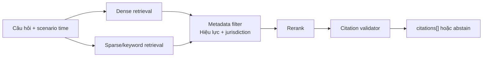

# 🚦 STWI — Tài liệu Đặc tả Kỹ thuật (Phần 3)

## Thiết kế Cơ sở Tri thức, Pháp lý & Truy vấn

| Thuộc tính | Giá trị |
|---|---|
| **Dự án** | SmartTraffic What-If (STWI) |
| **Mã tài liệu** | STWI-DOC-03 |
| **Phiên bản** | 1.4 |
| **Ngày tạo** | 15/06/2026 |
| **Cập nhật lần cuối** | 21/06/2026 |
| **Trạng thái** | 📝 Đang soạn thảo (Draft) |
| **Phân loại** | Tài liệu nội bộ — Đặc tả kỹ thuật |

> [!IMPORTANT]
> Tầng 3 cung cấp bằng chứng, không “hợp pháp hóa” một phương án. Khi không có căn cứ còn hiệu lực hoặc retrieval không đủ tin cậy, hệ thống phải abstain và trả `needs_review`.

## 1. Kho tri thức Qdrant

### 1.1. Corpus tối thiểu

| Nguồn | Yêu cầu |
|---|---|
| [Luật Đường bộ 35/2024/QH15](https://vanban.chinhphu.vn/?pageid=27160&docid=211193) | Hiệu lực 01/01/2025; ingest từ nguồn chính thức |
| [Luật Trật tự, an toàn giao thông đường bộ 36/2024/QH15](https://vanban.chinhphu.vn/?pageid=27160&docid=211194&classid=1&typegroupid=3) | Hiệu lực 01/01/2025; ingest từ nguồn chính thức |
| Nghị định/thông tư liên quan | Có owner pháp lý, ngày kiểm tra hiệu lực và nguồn chính thức |
| SOP vận hành | Có cơ quan ban hành, phiên bản, ngày duyệt và phạm vi áp dụng |
| Case lịch sử | Đã ẩn danh, có outcome và xác nhận của operator |

### 1.2. Chunk và metadata

Không chunk thuần theo câu. Mỗi chunk phải giữ nguyên điều/khoản hoặc một đơn vị SOP hoàn chỉnh.

```json
{
  "document_id": "law-36-2024-qh15",
  "title": "Luật Trật tự, an toàn giao thông đường bộ",
  "document_number": "36/2024/QH15",
  "provision": "Điều 10, Khoản 2",
  "source_url": "https://vanban.chinhphu.vn/",
  "effective_from": "2025-01-01",
  "effective_to": null,
  "superseded": false,
  "jurisdiction": "VN",
  "content_hash": "sha256:..."
}
```

Qdrant dùng dense embedding BGE-m3 và sparse/keyword signal cho hybrid retrieval. Query phải filter `effective_from <= scenario_time`, `effective_to` null hoặc lớn hơn scenario time, và `superseded=false`.

### 1.3. Retrieval pipeline



Metrics: recall@5, MRR, citation precision, effective-document precision và unsupported-claim rate. “Có field citation” không được coi là grounded nếu provision/source không khớp nội dung.

## 2. Constrained simulation query

MVP không cho LLM sinh SQL tự do. LLM chỉ ánh xạ câu hỏi sang `SimulationQuery` có kiểu; server validate rồi dựng SQL tham số hóa.

```json
{
  "job_id": "wf_01J...",
  "node_ids": ["A", "B"],
  "metrics": ["avg_speed_kmh", "vc_ratio"],
  "horizons_minutes": [5, 10, 15, 30],
  "aggregation": "avg",
  "order_by": "horizon_minutes",
  "limit": 100
}
```

| Lớp bảo vệ | Quy tắc |
|---|---|
| Schema | Pydantic enum cho table/metric/aggregation/order |
| SQL | Dựng bằng code; parameter binding; một SELECT duy nhất |
| Database | TimescaleDB read-only role; statement timeout và row limit |
| Access | Job chỉ đọc được result thuộc tenant/operator scope |
| Audit | Lưu QuerySpec, SQL template hash, latency và row count |
| Offline | DuckDB chỉ dùng phân tích dataset và contract tests |

Nếu LLM không tạo được QuerySpec hợp lệ, trả lỗi có cấu trúc; không tự sửa vô hạn hoặc fallback sang SQL thô.

## 3. Citation contract

```json
{
  "document_id": "law-36-2024-qh15",
  "title": "Luật Trật tự, an toàn giao thông đường bộ",
  "document_number": "36/2024/QH15",
  "provision": "Điều 10, Khoản 2",
  "source_url": "https://vanban.chinhphu.vn/",
  "effective_from": "2025-01-01",
  "effective_to": null,
  "content_hash": "sha256:...",
  "supporting_excerpt": "Trích đoạn ngắn dùng để kiểm chứng"
}
```

`citations[]` thay thế chuỗi căn cứ pháp lý không có cấu trúc. Citation validator phải xác nhận:

1. URL thuộc allowlist nguồn chính thức hoặc kho SOP nội bộ.
2. Văn bản còn hiệu lực tại `scenario_time`.
3. Điều/khoản tồn tại trong version đã ingest.
4. Excerpt hash khớp nội dung lưu.
5. Claim được hỗ trợ trực tiếp; nếu không thì loại claim hoặc abstain.

## 4. Case retrieval và OOD

Case lịch sử/corner case là collection riêng có scenario features, outcome, similarity metadata và operator validation.

- Online: retrieval chỉ cung cấp evidence cho evaluator/operator.
- Offline: case được dùng để thiết kế thêm SUMO run hoặc bổ sung training set.
- Không trộn row truy xuất trực tiếp vào input surrogate.
- Uncertainty cao, similarity thấp hoặc case chưa xác nhận đều dẫn đến `needs_review`.

## 5. Bảo mật và vòng đời dữ liệu

| Rủi ro | Kiểm soát |
|---|---|
| Prompt injection trong tài liệu | Treat content as data; system policy không lấy từ retrieved text |
| Văn bản hết hiệu lực | Effective-date filter + review định kỳ + superseded flag |
| SQL injection | Typed QuerySpec + parameterized builder + read-only role |
| Citation giả | Source allowlist + provision/content hash |
| Rò rỉ case vận hành | RBAC, tenant filter, audit log và ẩn danh |
| Corpus lỗi thời | Owner pháp lý và lịch kiểm tra hàng tháng trong MVP |

## 6. Acceptance gates

- Bộ test retrieval có tối thiểu 50 câu hỏi, gồm câu không trả lời được và văn bản hết hiệu lực.
- Citation precision ≥ 95% trên bộ test; unsupported claim phải bằng 0 sau validator/abstention.
- QuerySpec test bao phủ metric, filter, limit, tenant isolation và payload độc hại.
- Không có đường thực thi SQL thô từ output LLM.
- Mọi failure của retrieval/query được truyền thành trạng thái có cấu trúc, không bị che bởi câu trả lời tự do.

## Phụ lục: Lịch sử phiên bản

| Phiên bản | Ngày | Tác giả | Mô tả |
|---|---|---|---|
| 1.0 | 15/06/2026 | Nhóm STWI | Soạn thảo ban đầu |
| 1.1 | 15/06/2026 | Nhóm STWI | Chuẩn hóa format |
| 1.2 | 20/06/2026 | Nhóm STWI | Text-to-SQL đơn giản và case retrieval |
| 1.3 | 20/06/2026 | Nhóm STWI | Sửa Mermaid |
| 1.4 | 21/06/2026 | Nhóm STWI | Chốt Qdrant, luật hiện hành, chunk theo điều/khoản, typed SimulationQuery, structured citations và abstention |
