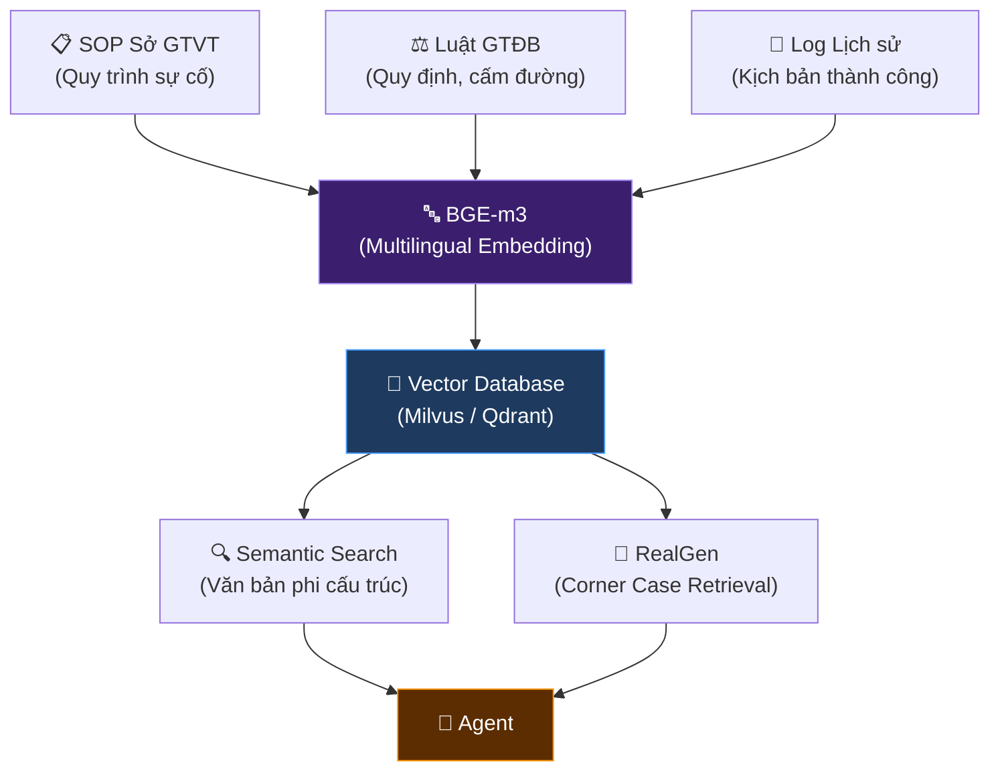
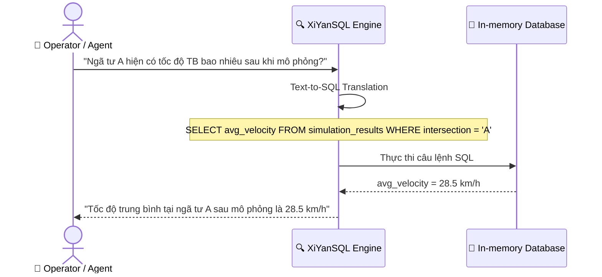
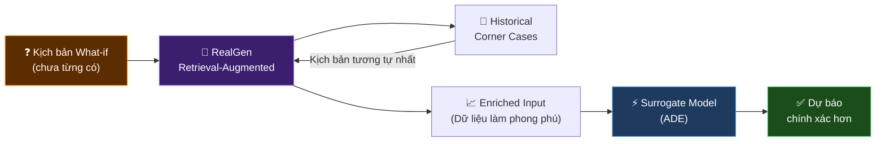

# 🚦 STWI — Tài liệu Đặc tả Kỹ thuật (Phần 3)

## Thiết kế Cơ sở Tri thức & RAG

| Thuộc tính | Giá trị |
|---|---|
| **Dự án** | SmartTraffic What-If (STWI) |
| **Mã tài liệu** | STWI-DOC-03 |
| **Phiên bản** | 1.1 |
| **Ngày tạo** | 15/06/2026 |
| **Cập nhật lần cuối** | 15/06/2026 |
| **Trạng thái** | 📝 Đang soạn thảo (Draft) |
| **Phân loại** | Tài liệu nội bộ — Đặc tả kỹ thuật |

> [!NOTE]
> Tài liệu này đặc tả **Tầng 3 — Hệ thống Truy xuất Tri thức (Knowledge Base & RAG)**, cung cấp căn cứ pháp lý và SOP vận hành cho các tác tử Agent, đảm bảo mọi quyết định điều phối đều có cơ sở hợp pháp.

---

## Mục lục

- [1. Cấu trúc Vector Database](#1-cấu-trúc-vector-database)
  - [1.1. Các nguồn Dữ liệu tích hợp](#11-các-nguồn-dữ-liệu-tích-hợp)
  - [1.2. Công nghệ Embedding & Lưu trữ](#12-công-nghệ-embedding--lưu-trữ)
- [2. Truy xuất Schema-Level với XiYanSQL](#2-truy-xuất-schema-level-với-xiyansql)
- [3. Component Cận biên: RealGen](#3-component-cận-biên-realgen)
- [Phụ lục](#phụ-lục)

---

## 1. Cấu trúc Vector Database

Cơ sở dữ liệu Vector là nền tảng lưu trữ toàn bộ **văn bản phi cấu trúc**, được embedding thành các vector đa chiều để tìm kiếm theo **độ tương đồng ngữ nghĩa (Semantic Search)**.

### Sơ đồ Tổng quan Tầng RAG

### 1.1. Các nguồn Dữ liệu tích hợp

| # | Nguồn dữ liệu | Nội dung | Ví dụ |
|---|---------------|----------|-------|
| **1** | Sổ tay SOP — Sở GTVT | Quy trình vận hành sự cố | Xử lý tràn dầu, đổ cây, ngập lụt cục bộ; Phối hợp CSGT, Cứu hỏa, Y tế |
| **2** | Luật Giao thông Đường bộ | Quy định pháp luật | Luồng tuyến, tốc độ giới hạn tạm thời, quy định ưu tiên, cấm đường |
| **3** | Log Kịch bản Lịch sử | Báo cáo xử lý sự cố quá khứ | Các case đã xác nhận thành công, được dùng làm tiền lệ tham khảo |

### 1.2. Công nghệ Embedding & Lưu trữ

| Thành phần | Công nghệ | Ghi chú |
|------------|-----------|---------|
| **Embedding Model** | `BGE-m3` | Mô hình đa ngôn ngữ, hỗ trợ tốt tiếng Việt để vector hóa văn bản pháp luật |
| **Vector DB Engine** | `Milvus` / `Qdrant` / `Pinecone` | Lựa chọn tùy hạ tầng triển khai |
| **Distance Metric** | Cosine Similarity | Chuẩn đo tương đồng ngữ nghĩa |
| **Chunk Strategy** | Sentence-level splitting | Tách văn bản theo câu/đoạn để giữ ngữ cảnh pháp lý |

---

## 2. Truy xuất Schema-Level với XiYanSQL

Bên cạnh dữ liệu phi cấu trúc, hệ thống STWI sản sinh ra một lượng lớn **dữ liệu có cấu trúc** từ Tầng Mô phỏng (ma trận số liệu lưu lượng dự báo). RAG truyền thống **không thể đọc** ma trận số liệu này một cách chính xác.

### Sơ đồ Luồng XiYanSQL

**Quy trình xử lý:**

| Bước | Hành động | Mô tả |
|------|-----------|-------|
| **1** | Nhận câu hỏi | Agent nhận câu hỏi ngôn ngữ tự nhiên từ người dùng |
| **2** | Text-to-SQL | XiYanSQL tự động sinh câu lệnh SQL từ câu hỏi (thay vì tìm kiếm văn bản) |
| **3** | Thực thi SQL | Lệnh SQL chạy trên In-memory Database chứa kết quả Tầng Mô phỏng |
| **4** | Trả kết quả | Kết quả số học **chính xác tuyệt đối** được trả về cho Agent |

> [!IMPORTANT]
> Đây là điểm khác biệt cốt lõi so với RAG truyền thống: thay vì "tìm văn bản gần đúng", XiYanSQL cho phép **truy vấn chính xác** vào dữ liệu có cấu trúc — đảm bảo Agent không "đoán" số liệu.

---

## 3. Component Cận biên: RealGen

### Thách thức

Một thách thức lớn trong mô phỏng giao thông là hiện tượng **Corner Cases** — các kịch bản cực hiếm mà mô hình chưa từng được huấn luyện (Ví dụ: tai nạn liên hoàn 5 xe + mưa bão lớn).

### Giải pháp: RealGen Component

| Khả năng | Mô tả |
|----------|-------|
| **Retrieval** | Khi người dùng hỏi kịch bản chưa từng có, RealGen truy xuất các kịch bản cận biên **tương tự nhất** trong lịch sử |
| **Augmentation** | Tái tạo và làm phong phú thêm dữ liệu đầu vào cho Tầng Mô phỏng |
| **Anti-Hallucination** | Giúp Surrogate Model (ADE) không bị dự đoán sai lạc trước dữ liệu ngoại lai (out-of-distribution) |

> [!WARNING]
> Nếu không có RealGen, mô hình Surrogate có nguy cơ cao đưa ra dự báo **sai lạc nghiêm trọng** với các kịch bản cực trị — dẫn đến đề xuất điều phối sai lầm và gây nguy hiểm thực tế.

---

## Phụ lục

### Lịch sử Phiên bản

| Phiên bản | Ngày | Tác giả | Mô tả thay đổi |
|-----------|------|---------|-----------------|
| 1.0 | 15/06/2026 | Nhóm STWI | Soạn thảo ban đầu |
| 1.1 | 15/06/2026 | Nhóm STWI | Chuẩn hóa format doanh nghiệp, sửa lỗi Mermaid render, bỏ các ký tự đặc biệt gây lỗi |

### Tài liệu Liên quan

- ⬅️ Tài liệu trước: [02_ML_and_Simulation_Specification.md](./02_ML_and_Simulation_Specification.md)
- ➡️ Tài liệu tiếp: [04_AI_Agent_Orchestrator_CF_VLA.md](./04_AI_Agent_Orchestrator_CF_VLA.md)
