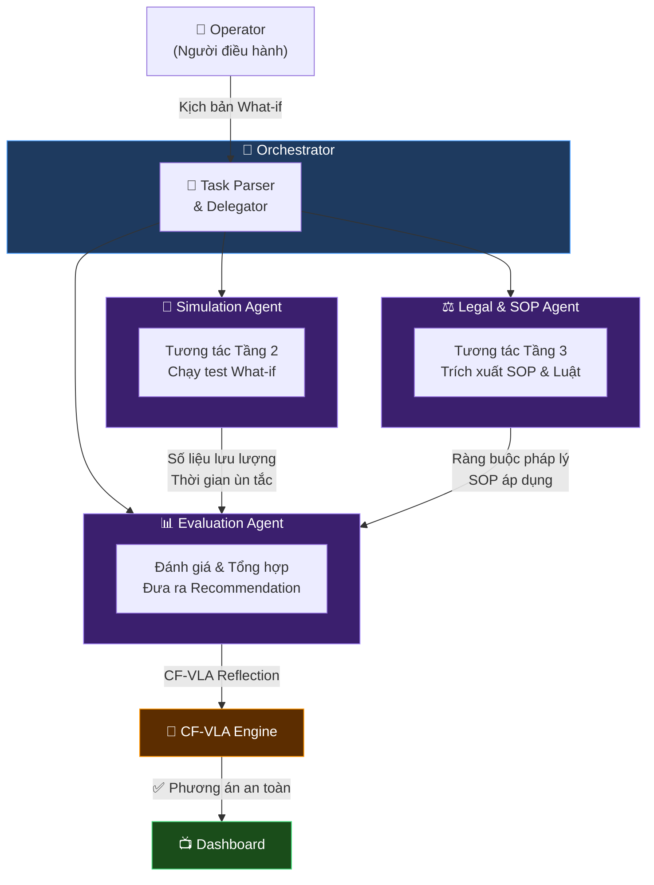
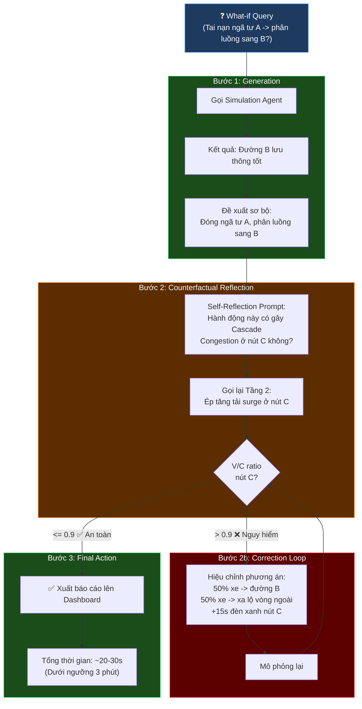

# 🚦 STWI — Tài liệu Đặc tả Kỹ thuật (Phần 4)

## Đặc tả Tác tử AI & Luồng Suy luận CF-VLA

| Thuộc tính | Giá trị |
|---|---|
| **Dự án** | SmartTraffic What-If (STWI) |
| **Mã tài liệu** | STWI-DOC-04 |
| **Phiên bản** | 1.1 |
| **Ngày tạo** | 15/06/2026 |
| **Cập nhật lần cuối** | 15/06/2026 |
| **Trạng thái** | 📝 Đang soạn thảo (Draft) |
| **Phân loại** | Tài liệu nội bộ — Đặc tả kỹ thuật |

> [!NOTE]
> Tài liệu này thiết kế **Tầng 4 — Bộ não Điều phối của Hệ thống (AI Agent Orchestrator)**, sử dụng kiến trúc Multi-Agent kết hợp luồng suy luận tự phản biện CF-VLA (Counterfactual – Vision Language Action) để đảm bảo mọi quyết định điều phối đều an toàn và có căn cứ.

---

## Mục lục

- [1. Kiến trúc Multi-Agent](#1-kiến-trúc-multi-agent)
- [2. Luồng Suy luận CF-VLA](#2-luồng-suy-luận-cf-vla)
  - [2.1. Generation (Khởi tạo phương án)](#21-generation-khởi-tạo-phương-án)
  - [2.2. Counterfactual Reflection (Phản biện)](#22-counterfactual-reflection-phản-biện-thực-tế-ảo)
  - [2.3. Correction & Final Action (Hiệu chỉnh)](#23-correction--final-action-hiệu-chỉnh-và-quyết-định)
- [3. API Tương tác của Orchestrator](#3-api-tương-tác-của-orchestrator)
- [Phụ lục](#phụ-lục)

---

## 1. Kiến trúc Multi-Agent

Hệ thống STWI sử dụng mô hình **Multi-Agent** để xử lý ngôn ngữ tự nhiên thành chuỗi tác vụ phức tạp (Task Delegation). Orchestrator đóng vai trò *"Trưởng phòng điều phối giao thông ảo"*, điều phối 3 tác tử con:

### Sơ đồ Kiến trúc Multi-Agent



### Bảng Đặc tả Tác tử

| Tác tử | Vai trò | Input | Output |
|--------|---------|-------|--------|
| **Simulation Agent** | Tương tác với Tầng 2 (Neural Surrogate) để chạy test What-if | Vector trạng thái sự kiện | Số liệu lưu lượng, thời gian ùn tắc kỳ vọng |
| **Legal & SOP Agent** | Tương tác với Tầng 3 (RAG) để trích xuất quy trình & quy định | Câu hỏi pháp lý liên quan | Các ràng buộc hợp pháp hóa phương án |
| **Evaluation Agent** | Đánh giá tổng hợp kết quả và đưa ra đề xuất tốt nhất | Kết quả từ 2 Agent trên | Phương án điều tiết (Recommendation) |

---

## 2. Luồng Suy luận CF-VLA

Đây là cơ chế **tự phản biện cốt lõi** giúp hệ thống tránh đưa ra quyết định *"có vẻ đúng nhưng thực tế gây hậu quả xấu"*.

> [!CAUTION]
> Luồng CF-VLA là **lớp an toàn bắt buộc**. Tuyệt đối KHÔNG được bypass bước Counterfactual Reflection trong bất kỳ trường hợp nào.

### Sơ đồ Luồng CF-VLA



### 2.1. Generation (Khởi tạo phương án)

Khi người dùng đặt câu hỏi What-if: *"Tai nạn ở ngã tư A, nếu tôi chuyển hướng dòng xe sang đường B thì sao?"*

| Bước | Hành động | Kết quả |
|------|-----------|---------|
| 1 | Agent gọi mô phỏng | Đường B sẽ lưu thông tốt, ngã tư A được giải tỏa |
| 2 | Sinh đề xuất sơ bộ | *"Đóng ngã tư A, phân luồng sang đường B"* |

### 2.2. Counterfactual Reflection (Phản biện Thực tế Ảo)

Thay vì xuất ngay kết quả, Agent tự kích hoạt **phiên mô phỏng thứ 2** (Counterfactual):

| Yếu tố | Chi tiết |
|---------|----------|
| **Self-Reflection Prompt** | *"Kiểm tra xem hành động 'Phân luồng sang đường B' có gây Cascade Congestion ở nút giao kế tiếp (nút C) do lượng xe đổ về quá đột ngột hay không?"* |
| **Verification** | Gọi lại Tầng 2, ép tăng tải (surge) ở nút C |
| **Ngưỡng an toàn** | V/C ratio <= **0.9** |
| **Nếu vượt ngưỡng** | Agent nhận thức đề xuất sơ bộ là **sai lầm** → vào vòng Correction |

### 2.3. Correction & Final Action (Hiệu chỉnh và Quyết định)

| Trạng thái | Hành động |
|------------|-----------|
| **V/C > 0.9** (Không an toàn) | Agent hiệu chỉnh phương án: *"Chỉ phân luồng 50% xe sang đường B, 50% đi xa lộ vòng ngoài. Mở thời lượng đèn xanh nút C thêm 15 giây."* -> Mô phỏng lại |
| **V/C <= 0.9** (An toàn) | Xuất báo cáo lên Dashboard cho Operator. Tổng thời gian xử lý: **~20–30 giây** (trong ngưỡng 3 phút) |

---

## 3. API Tương tác của Orchestrator

Đóng gói các chức năng trên qua **REST API / WebSocket**.

### Endpoint

`POST /api/v1/agent/what-if`

### Request Payload

```json
{
  "scenario": "Tai nạn ở ngã tư A, nếu tôi chuyển hướng dòng xe sang đường B thì sao?",
  "constraints": {
    "max_computation_time_ms": 3000,
    "priority": "high"
  }
}
```

### Response

```json
{
  "status": "success",
  "recommended_action": "Phân luồng 50% xe sang đường B, 50% đi xa lộ. Tăng 15s đèn xanh nút C.",
  "simulation_metrics": {
    "node_A_clearance_time_mins": 12,
    "node_B_vc_ratio": 0.75,
    "node_C_vc_ratio": 0.85
  },
  "legal_grounding": "SOP số 14 về xử lý tai nạn nút giao trọng điểm.",
  "cf_vla_reflection": {
    "iterations": 2,
    "initial_proposal_rejected": true,
    "rejection_reason": "Cascade congestion detected at node C (V/C = 0.95)"
  },
  "latency_ms": 1450
}
```

### Mô tả các Trường Response

| Trường | Kiểu | Mô tả |
|--------|------|-------|
| `status` | string | Trạng thái xử lý: `success` / `error` |
| `recommended_action` | string | Phươn án điều phối được đề xuất |
| `simulation_metrics` | object | Các chỉ số từ mô phỏng (V/C ratio, thời gian giải tỏa) |
| `legal_grounding` | string | Căn cứ pháp lý / SOP tham chiếu |
| `cf_vla_reflection` | object | Thông tin về quá trình tự phản biện CF-VLA |
| `latency_ms` | number | Thời gian xử lý tổng (ms) |

---

## Phụ lục

### Lịch sử Phiên bản

| Phiên bản | Ngày | Tác giả | Mô tả thay đổi |
|-----------|------|---------|-----------------|
| 1.0 | 15/06/2026 | Nhóm STWI | Soạn thảo ban đầu |
| 1.1 | 15/06/2026 | Nhóm STWI | Chuẩn hóa format doanh nghiệp, sửa lỗi Mermaid render ở các subgraph và các mũi tên |

### Tài liệu Liên quan

- ⬅️ Tài liệu trước: [03_Knowledge_Base_and_RAG_Design.md](./03_Knowledge_Base_and_RAG_Design.md)
- ➡️ Tài liệu tổng hợp: [00_STWI_Summary_and_Guidelines.md](./00_STWI_Summary_and_Guidelines.md)
