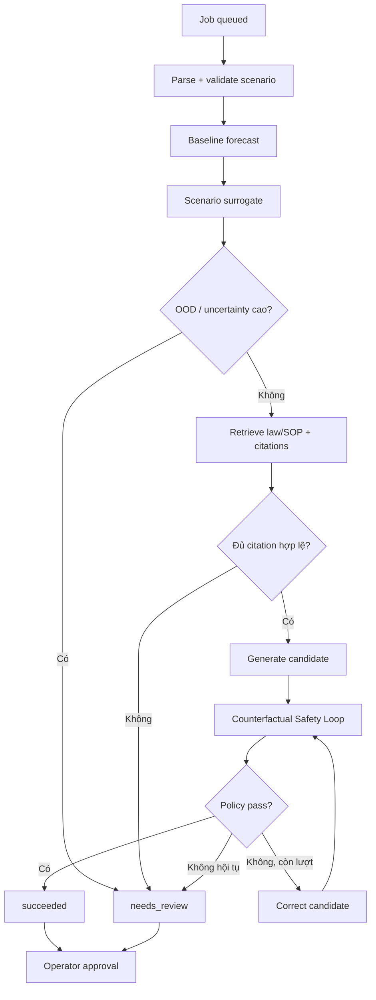

# 🚦 STWI — Tài liệu Đặc tả Kỹ thuật (Phần 4)

## LangGraph Orchestrator & Counterfactual Safety Loop

| Thuộc tính | Giá trị |
|---|---|
| **Dự án** | SmartTraffic What-If (STWI) |
| **Mã tài liệu** | STWI-DOC-04 |
| **Phiên bản** | 1.4 |
| **Ngày tạo** | 15/06/2026 |
| **Cập nhật lần cuối** | 21/06/2026 |
| **Trạng thái** | 📝 Đang soạn thảo (Draft) |
| **Phân loại** | Tài liệu nội bộ — Đặc tả kỹ thuật |

> [!NOTE]
> Cơ chế của STWI là **Counterfactual Safety Loop (CSL), lấy cảm hứng từ CF-VLA**. CF-VLA gốc là mô hình Vision–Language–Action end-to-end dùng ngữ cảnh thị giác để điều chỉnh quỹ đạo; STWI chỉ áp dụng ý tưởng tự phản biện vào workflow dữ liệu–mô phỏng–pháp lý: [arXiv:2512.24426](https://arxiv.org/abs/2512.24426).

## 1. Workflow điều phối

LangGraph được dùng như state machine có node chuyên trách; “agent” không được tự ý thay đổi policy hoặc gọi tool ngoài allowlist.



| Node | Trách nhiệm | Không được làm |
|---|---|---|
| Parser | Chuẩn hóa scenario và `IncidentVector` | Suy đoán node không tồn tại |
| Simulation | Gọi baseline/surrogate có version | Tự bỏ qua OOD gate |
| Knowledge | QuerySpec + Qdrant + citation validator | Chạy SQL thô hoặc dùng văn bản hết hiệu lực |
| Evaluator | Sinh candidate từ metrics/evidence | Biến evidence yếu thành khẳng định |
| Safety | Chạy tối đa 3 counterfactual iterations | Trả action thực thi khi chưa pass |
| Reporter | Đóng gói result và audit | Xóa warning/provenance |

## 2. Counterfactual Safety Loop

### 2.1. Policy

Ngưỡng V/C mặc định `0.9` là cấu hình MVP, không phải luật. Safety policy có version và kiểm tra tối thiểu:

- max V/C của node bị ảnh hưởng và node lân cận;
- network delay và spillback proxy;
- uncertainty/OOD;
- citation validity;
- constraints người vận hành;
- dữ liệu thiếu/degraded.

### 2.2. Fail-closed

| Điều kiện | Trạng thái |
|---|---|
| Tất cả check pass và có citation | `succeeded` + `recommended_action` |
| Không hội tụ sau 3 vòng | `needs_review` + `candidate_action` |
| OOD/uncertainty cao | `needs_review`; không gọi candidate là recommendation |
| Thiếu citation còn hiệu lực | `needs_review` hoặc `failed` tùy loại lỗi |
| Tool/runtime lỗi không phục hồi | `failed` |
| Vượt 180 giây | `expired` |

MVP không có actuator. Ngay cả `succeeded` vẫn cần operator phê duyệt và quyết định được ghi vào audit log.

## 3. API bất đồng bộ

### 3.1. Tạo job

`POST /api/v1/what-if-jobs` → HTTP 202

```json
{
  "scenario": "Tai nạn tại node A; đánh giá phương án phân luồng sang B",
  "scenario_time": "2026-06-21T08:00:00+07:00",
  "constraints": {
    "deadline_ms": 180000,
    "priority": "high"
  }
}
```

```json
{
  "job_id": "wf_01J...",
  "status": "queued",
  "status_url": "/api/v1/what-if-jobs/wf_01J...",
  "events_url": "/api/v1/what-if-jobs/wf_01J.../events",
  "trace_id": "tr_01J...",
  "created_at": "2026-06-21T08:00:01+07:00"
}
```

### 3.2. Theo dõi job

- `GET /api/v1/what-if-jobs/{job_id}`: snapshot trạng thái và result.
- `GET /api/v1/what-if-jobs/{job_id}/events`: SSE với `stage`, `iteration`, `progress`, `message`, `timestamp`.
- Status enum: `queued`, `running`, `succeeded`, `needs_review`, `failed`, `expired`.

### 3.3. Kết quả succeeded

```json
{
  "job_id": "wf_01J...",
  "status": "succeeded",
  "recommended_action": {
    "summary": "Phân luồng tối đa 40% sang tuyến B và điều chỉnh green-time ratio tại C",
    "requires_operator_approval": true
  },
  "simulation_metrics": {
    "max_vc_ratio": 0.86,
    "network_delay_seconds": 740,
    "clearance_time_minutes": 18
  },
  "citations": [
    {
      "document_id": "sop-incident-14",
      "title": "SOP xử lý tai nạn nút giao",
      "document_number": "SOP-14",
      "provision": "Mục 3.2",
      "source_url": "https://internal.example/sop-14",
      "effective_from": "2026-01-01",
      "effective_to": null,
      "content_hash": "sha256:..."
    }
  ],
  "safety_evaluation": {
    "policy_version": "csl-1.0",
    "iterations": 2,
    "converged": true,
    "default_vc_threshold": 0.9
  },
  "model_versions": {
    "forecast": "gcn-lstm-1.0",
    "surrogate": "ensemble-1.0"
  },
  "trace_id": "tr_01J...",
  "latency_ms": 21400
}
```

### 3.4. Kết quả needs_review

```json
{
  "job_id": "wf_01J...",
  "status": "needs_review",
  "candidate_action": {
    "summary": "Phương án thử nghiệm: phân luồng 20% sang B",
    "executable": false,
    "requires_operator_approval": true
  },
  "warnings": [
    {
      "code": "SAFETY_NOT_CONVERGED",
      "message": "Không đạt policy sau 3 vòng; max V/C còn 0.93"
    }
  ],
  "citations": [],
  "safety_evaluation": {
    "policy_version": "csl-1.0",
    "iterations": 3,
    "converged": false
  },
  "trace_id": "tr_01J...",
  "latency_ms": 29600
}
```

### 3.5. Error model

```json
{
  "job_id": "wf_01J...",
  "status": "failed",
  "error": {
    "code": "SIMULATION_UNAVAILABLE",
    "message": "Surrogate worker không khả dụng",
    "retryable": true
  },
  "trace_id": "tr_01J..."
}
```

Error codes tối thiểu: `INVALID_SCENARIO`, `UNKNOWN_NODE`, `SIMULATION_UNAVAILABLE`, `KNOWLEDGE_UNAVAILABLE`, `QUERY_INVALID`, `POLICY_ERROR`, `INTERNAL_ERROR`.

## 4. Runtime và observability

- FastAPI tiếp nhận request; Celery chạy job; Redis làm broker/progress store.
- Mỗi transition LangGraph phát SSE event và OpenTelemetry span.
- Retry chỉ áp dụng tool idempotent, có backoff và giới hạn.
- Hard deadline 180 giây được truyền xuống mọi tool.
- Lưu scenario hash, input/model/policy/corpus version, citations, iterations và operator decision.
- E2E target P95 ≤ 30 giây; P99/hard deadline ≤ 180 giây.

## 5. Acceptance gates

1. API examples parse được và đúng status/field contract.
2. `recommended_action` không xuất hiện ở bất kỳ status nào ngoài `succeeded`.
3. `needs_review` luôn có `candidate_action.executable=false`.
4. OOD, thiếu citation, policy fail và timeout đều được test.
5. SSE reconnect không chạy lặp job.
6. Operator approval và audit log được kiểm thử.
7. Không có code path điều khiển thiết bị hiện trường.

## Phụ lục: Lịch sử phiên bản

| Phiên bản | Ngày | Tác giả | Mô tả |
|---|---|---|---|
| 1.0 | 15/06/2026 | Nhóm STWI | Soạn thảo ban đầu |
| 1.1 | 15/06/2026 | Nhóm STWI | Chuẩn hóa diagram |
| 1.2 | 20/06/2026 | Nhóm STWI | LangGraph và partial/error response |
| 1.3 | 20/06/2026 | Nhóm STWI | Đồng bộ version |
| 1.4 | 21/06/2026 | Nhóm STWI | Định vị CF-VLA-inspired đúng phạm vi, fail-closed, async jobs + SSE, structured citations và human approval |
