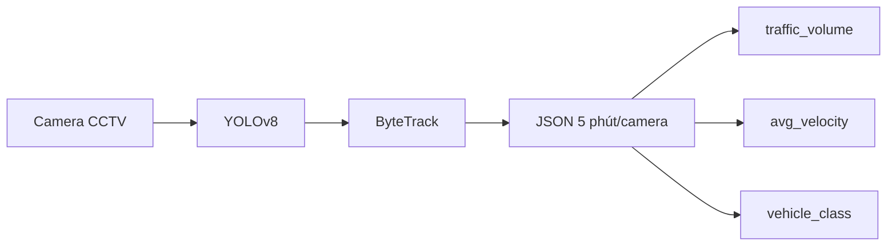
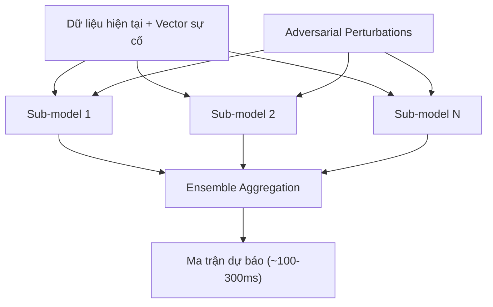
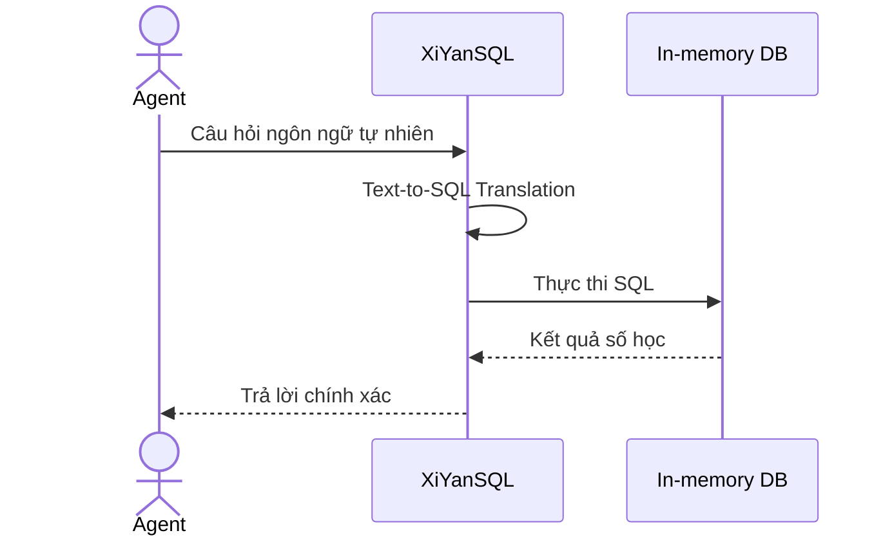
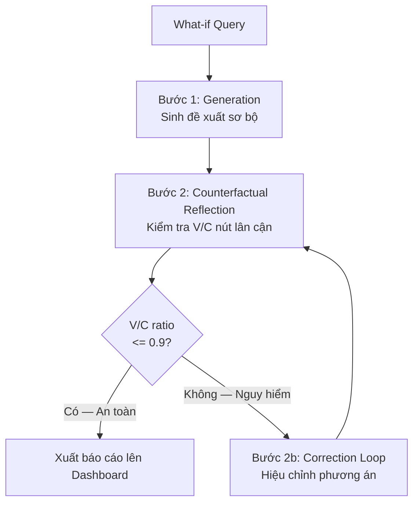

# 🗺️ KẾ HOẠCH TRIỂN KHAI DỰ ÁN STWI

| Thuộc tính | Giá trị |
|---|---|
| **Dự án** | SmartTraffic What-If (STWI) |
| **Mã tài liệu** | STWI-DOC-05 |
| **Phiên bản** | 1.0 |
| **Ngày tạo** | 19/06/2026 |
| **Trạng thái** | 📝 Đang soạn thảo (Draft) |
| **Phân loại** | Tài liệu nội bộ — Kế hoạch triển khai |

> [!NOTE]
> Tài liệu này là kế hoạch triển khai chi tiết theo từng giai đoạn (Phase) cho hệ thống STWI, dựa trên kiến trúc 4 tầng được đặc tả trong các tài liệu STWI-DOC-01 đến STWI-DOC-04.

---

## Mục lục

- [Tổng quan Timeline](#tổng-quan-timeline)
- [Phase 0 — Project Bootstrap](#phase-0--project-bootstrap-tuần-1)
- [Phase 1 — Tầng 1: Data Pipeline](#phase-1--tầng-1-data-pipeline-tuần-2-4)
- [Phase 2 — Tầng 2: ML & Surrogate Model](#phase-2--tầng-2-ml--surrogate-model-tuần-3-8)
- [Phase 3 — Tầng 3: Knowledge Base & RAG](#phase-3--tầng-3-knowledge-base--rag-tuần-5-9)
- [Phase 4 — Tầng 4: Agent Orchestrator & Tích hợp E2E](#phase-4--tầng-4-agent-orchestrator--tích-hợp-e2e-tuần-8-12)
- [Lịch Timeline Tổng hợp](#lịch-timeline-tổng-hợp)
- [Danh sách Rủi ro & Biện pháp](#danh-sách-rủi-ro--biện-pháp)
- [Nguyên tắc vàng xuyên suốt](#nguyên-tắc-vàng-xuyên-suốt-mọi-giai-đoạn)

---

## Tổng quan Timeline

Dự án được chia thành **5 giai đoạn (Phase)** tương ứng với kiến trúc 4 tầng hệ thống, triển khai song song theo mô hình Agile/Sprint:

```
Phase 0 → Phase 1 → Phase 2 → Phase 3 → Phase 4
(Setup)   (Tầng 1)  (Tầng 2)  (Tầng 3)  (Tầng 4 + Tích hợp)
```

---

## Phase 0 — Project Bootstrap (Tuần 1)

**Mục tiêu:** Dựng hạ tầng, chuẩn hóa toolchain, đảm bảo mọi thành viên làm việc đồng nhất.

| Task | Chi tiết | Output |
|------|----------|--------|
| **0.1 Monorepo Setup** | Tạo cấu trúc thư mục theo 4 tầng: `tier1-data/`, `tier2-ml/`, `tier3-rag/`, `tier4-agent/`, `api/`, `dashboard/` | Repo chuẩn |
| **0.2 Dev Environment** | Docker Compose: PostgreSQL (metadata), Redis (cache), MinIO (model storage). Python 3.11+, PyTorch 2.x | `docker-compose.yml` hoạt động |
| **0.3 CI/CD Pipeline** | GitHub Actions: lint → test → build. Pre-commit hooks: ruff, mypy | Pipeline chạy được |
| **0.4 Data Contract** | Định nghĩa schema `InputTensor[Batch, 12, 14]` dưới dạng Pydantic models. **Đây là hợp đồng bất biến** — mọi tầng phải tuân theo | `schemas/tensor_schema.py` |
| **0.5 Logging & Tracing** | Tích hợp OpenTelemetry để đo TTP (Time-to-Prediction) ngay từ đầu | Tracing dashboard |

---

## Phase 1 — Tầng 1: Data Pipeline (Tuần 2–4)

**Mục tiêu:** Có dữ liệu chuẩn hóa `[Batch, 12, 14]` chảy vào Tầng 2.

### Sprint 1.1 — CCTV Pipeline (Tuần 2)



| Task | Chi tiết |
|------|----------|
| **1.1.1** | Setup YOLOv8 inference pipeline (có thể dùng mock video nếu chưa có camera thật) |
| **1.1.2** | Tích hợp ByteTrack để tránh đếm trùng phương tiện giữa các frame |
| **1.1.3** | Đầu ra: JSON record mỗi 5 phút/camera, lưu vào TimeSeries DB (InfluxDB hoặc PostgreSQL với TimescaleDB) |
| **1.1.4** | **Test:** Unit test kiểm tra `vehicle_class` phân loại đúng 4 loại (xe máy, ô tô, tải, buýt) |

### Sprint 1.2 — Sensor Pipeline (Tuần 2–3)

| Task | Chi tiết |
|------|----------|
| **1.2.1** | Viết MQTT subscriber hoặc REST polling adapter cho 8 loại cảm biến |
| **1.2.2** | Xử lý missing data: interpolation nếu cảm biến bị ngắt < 15 phút |
| **1.2.3** | Đầu ra: Đồng bộ với chu kỳ 5 phút của CCTV pipeline |

**Danh sách 8 biến cảm biến:**

| Nhóm | Biến |
|------|------|
| Khí thải | CO, CO₂, NOx, PM₂.₅, PM₁₀ |
| Khí tượng | Nhiệt độ (°C), Độ ẩm (%), Tốc độ gió (m/s) |

### Sprint 1.3 — Normalization & Tensor Builder (Tuần 3–4)

| Task | Chi tiết |
|------|----------|
| **1.3.1** | Implement `MinMaxScaler` với scaler state được persist (tránh data leakage khi inference) |
| **1.3.2** | Ghép 14 features: 3 giao thông + 5 khí thải + 3 khí tượng + 3 phụ trợ (giờ/ngày/đèn tín hiệu) |
| **1.3.3** | Sliding window `T=12` với stride 1 để tạo batch |
| **1.3.4** | **Test tích hợp:** Validate output shape `assert tensor.shape == (batch_size, 12, 14)` |

> [!NOTE]
> **Cột mốc Phase 1:** Pipeline synthetic data tạo được tensor `[32, 12, 14]` đúng spec — Tầng 2 có thể bắt đầu huấn luyện.

---

## Phase 2 — Tầng 2: ML & Surrogate Model (Tuần 3–8)

**Mục tiêu:** Mô hình dự báo chạy được, `TTP P99 < 500ms`.

### Sprint 2.1 — Xây dựng Traffic Graph (Tuần 3–4)

| Task | Chi tiết |
|------|----------|
| **2.1.1** | Xây dựng Adjacency Matrix `W` từ dữ liệu bản đồ thực (OSM hoặc dữ liệu Sở GTVT) |
| **2.1.2** | Chuẩn hóa ma trận kề: `Ã = A + I_N`, tính `D̃^(-1/2) * Ã * D̃^(-1/2)` |
| **2.1.3** | Đóng gói graph thành `torch_geometric` Data object |

### Sprint 2.2 — STGCN + Stacked LSTM (Tuần 4–6)

| Task | Chi tiết |
|------|----------|
| **2.2.1** | Implement GCN layers theo công thức: `H^(l+1) = σ(D̃^(-1/2) Ã D̃^(-1/2) H^(l) W^(l))` |
| **2.2.2** | Stack 2–3 LSTM layers phía sau GCN |
| **2.2.3** | Output: Tensor dự báo 6 bước (30 phút tương lai) |
| **2.2.4** | Training loop: Loss = MAE + RMSE. Logging qua MLflow |
| **2.2.5** | Đánh giá: RMSE, MAE, F1-Score theo 3 class (Bình thường / Ùn ứ / Kẹt cứng) |

### Sprint 2.3 — Surrogate Model ADE (Tuần 6–8)



| Task | Chi tiết |
|------|----------|
| **2.3.1** | Xây dựng N sub-models với kiến trúc khác nhau (MLP, CNN-1D, Transformer nhẹ) |
| **2.3.2** | Adversarial training: Thêm nhiễu vào corner cases (tai nạn, ngập, tắc cứng) |
| **2.3.3** | Ensemble aggregation: Weighted average dựa trên uncertainty |
| **2.3.4** | **Benchmark bắt buộc:** Đo TTP P99 — phải `< 500ms`. Nếu không: pruning/quantization |
| **2.3.5** | Đóng gói API nội bộ: `POST /internal/simulate` nhận vector sự cố, trả ma trận kết quả |

> [!NOTE]
> **Cột mốc Phase 2:** `POST /internal/simulate` trả kết quả trong < 500ms với input là vector sự cố chuẩn.

---

## Phase 3 — Tầng 3: Knowledge Base & RAG (Tuần 5–9)

**Mục tiêu:** Agent có thể tra cứu SOP/Luật và query số liệu bằng ngôn ngữ tự nhiên.

> [!TIP]
> Phase 3 bắt đầu **song song** với Phase 2 từ Tuần 5.

### Sprint 3.1 — Thu thập & Chuẩn bị Văn bản (Tuần 5–6)

| Task | Chi tiết |
|------|----------|
| **3.1.1** | Thu thập: SOP Sở GTVT, Luật GTĐB, log kịch bản lịch sử |
| **3.1.2** | Làm sạch văn bản: Loại bỏ header/footer PDF, chuẩn hóa encoding UTF-8 |
| **3.1.3** | Chunking strategy: Sentence-level splitting, giữ nguyên context pháp lý (không cắt giữa điều khoản) |

### Sprint 3.2 — Vector Database (Tuần 6–7)

| Task | Chi tiết |
|------|----------|
| **3.2.1** | Setup Qdrant (self-hosted) hoặc Milvus |
| **3.2.2** | Embedding bằng `BGE-m3` (multilingual, hỗ trợ tốt tiếng Việt) |
| **3.2.3** | Index với Cosine Similarity metric |
| **3.2.4** | **Test:** Semantic search cho 20 câu hỏi pháp lý mẫu, đánh giá recall@5 |

### Sprint 3.3 — XiYanSQL Integration (Tuần 7–8)



| Task | Chi tiết |
|------|----------|
| **3.3.1** | Setup In-memory DB (SQLite in-memory hoặc DuckDB) nhận kết quả từ Tầng 2 |
| **3.3.2** | Schema cố định: `simulation_results(intersection_id, timestamp, avg_velocity, vc_ratio, volume)` |
| **3.3.3** | Tích hợp XiYanSQL để text-to-SQL |
| **3.3.4** | **Test:** 10 câu truy vấn mẫu, kiểm tra SQL được sinh ra đúng |

### Sprint 3.4 — RealGen Component (Tuần 8–9)

| Task | Chi tiết |
|------|----------|
| **3.4.1** | Xây dựng Corner Case database từ log lịch sử |
| **3.4.2** | Implement retrieval: Similarity search để tìm kịch bản gần nhất |
| **3.4.3** | Augmentation: Blend retrieved data vào input vector trước khi đưa vào ADE |

> [!NOTE]
> **Cột mốc Phase 3:** Legal Agent có thể trả lời "Theo SOP số mấy thì xử lý tai nạn ngã tư thế nào?" với trích dẫn chính xác.

---

## Phase 4 — Tầng 4: Agent Orchestrator & Tích hợp E2E (Tuần 8–12)

**Mục tiêu:** Hệ thống E2E từ câu hỏi What-if đến báo cáo hành động < 3 phút.

### Sprint 4.1 — Multi-Agent Framework (Tuần 8–9)

| Task | Chi tiết |
|------|----------|
| **4.1.1** | Setup LangChain hoặc CrewAI làm Orchestrator framework |
| **4.1.2** | Implement `SimulationAgent`: Tool gọi `POST /internal/simulate` |
| **4.1.3** | Implement `LegalAgent`: Tool gọi Vector DB + XiYanSQL |
| **4.1.4** | Implement `EvaluationAgent`: Tổng hợp kết quả 2 agent trên |

### Sprint 4.2 — CF-VLA Engine (Tuần 9–10)

> [!CAUTION]
> Đây là bước **CỐT LÕI AN TOÀN**. Tuyệt đối KHÔNG được bypass luồng Counterfactual Reflection trong bất kỳ trường hợp nào.



| Task | Chi tiết |
|------|----------|
| **4.2.1** | Implement Generation step: Sinh đề xuất sơ bộ từ kết quả 2 tầng |
| **4.2.2** | **[BẮT BUỘC]** Implement Counterfactual Reflection: Gọi ADE lần 2 với tải surge tại nút lân cận |
| **4.2.3** | Implement ngưỡng an toàn: `V/C <= 0.9` tại **tất cả** nút → OK; ngược lại → Correction |
| **4.2.4** | Implement Correction Loop (tối đa 3 vòng lặp để tránh infinite loop) |
| **4.2.5** | Đảm bảo mọi output đều có `legal_grounding` — không được phép hallucinate |

### Sprint 4.3 — REST API & Dashboard (Tuần 10–11)

**Endpoint:** `POST /api/v1/agent/what-if`

**Request:**
```json
{
  "scenario": "Tai nạn ở ngã tư A, nếu tôi chuyển hướng dòng xe sang đường B thì sao?",
  "constraints": {
    "max_computation_time_ms": 3000,
    "priority": "high"
  }
}
```

**Response:**
```json
{
  "status": "success",
  "recommended_action": "Phân luồng 50% xe sang đường B, 50% đi xa lộ. Tăng 15s đèn xanh nút C.",
  "simulation_metrics": {
    "node_A_clearance_time_mins": 12,
    "node_B_vc_ratio": 0.75,
    "node_C_vc_ratio": 0.85
  },
  "legal_grounding": "SOP số 14 về xử lý tai nạn nút giao trọng điểm.",
  "cf_vla_reflection": {
    "iterations": 2,
    "initial_proposal_rejected": true,
    "rejection_reason": "Cascade congestion detected at node C (V/C = 0.95)"
  },
  "latency_ms": 1450
}
```

| Task | Chi tiết |
|------|----------|
| **4.3.1** | Implement `POST /api/v1/agent/what-if` đúng theo spec trong STWI-DOC-04 |
| **4.3.2** | Response bắt buộc đủ 6 trường: `recommended_action`, `simulation_metrics`, `legal_grounding`, `cf_vla_reflection`, `latency_ms`, `status` |
| **4.3.3** | Dashboard: Hiển thị V/C ratio các nút giao, đề xuất hành động, trích dẫn pháp lý |
| **4.3.4** | WebSocket cho real-time update khi Correction Loop đang chạy |

### Sprint 4.4 — E2E Testing & Performance Tuning (Tuần 11–12)

| Task | Tiêu chí Pass |
|------|---------------|
| **4.4.1** Load test 10 kịch bản đồng thời | P99 end-to-end < 3 phút |
| **4.4.2** Benchmark TTP lõi AI | TTP P99 < 500ms |
| **4.4.3** Test corner cases (kịch bản chưa từng có) | RealGen kích hoạt đúng |
| **4.4.4** Test CF-VLA với đề xuất sai (V/C > 0.9) | Hệ thống tự hiệu chỉnh |
| **4.4.5** Kiểm tra No-Hallucination Policy | 100% response có `legal_grounding` |

> [!NOTE]
> **Cột mốc Phase 4 (Demo cuối):** Nhập "Tai nạn ngã tư A → phân luồng sang B?" → Nhận báo cáo đầy đủ < 3 phút, có trích dẫn pháp lý.

---

## Lịch Timeline Tổng hợp

```
Tuần:  1    2    3    4    5    6    7    8    9   10   11   12
       ┌────┐
Ph.0   █████
       └────┘
            ┌───────────────┐
Ph.1        █████████████████
            └───────────────┘
                  ┌─────────────────────────┐
Ph.2              ███████████████████████████
                  └─────────────────────────┘
                             ┌──────────────────────┐
Ph.3                         ██████████████████████
                             └──────────────────────┘
                                        ┌──────────────────────┐
Ph.4                                    ██████████████████████
                                        └──────────────────────┘
```

| Phase | Thời gian | Deliverable chính |
|-------|-----------|-------------------|
| Phase 0 | Tuần 1 | Repo + CI/CD + Data Contract |
| Phase 1 | Tuần 2–4 | Tensor `[B, 12, 14]` pipeline |
| Phase 2 | Tuần 3–8 | Surrogate Model TTP < 500ms |
| Phase 3 | Tuần 5–9 | Vector DB + XiYanSQL + RealGen |
| Phase 4 | Tuần 8–12 | API E2E + CF-VLA + Dashboard |

---

## Danh sách Rủi ro & Biện pháp

| # | Rủi ro | Xác suất | Biện pháp |
|---|--------|----------|-----------|
| **R1** | TTP Surrogate Model > 500ms | Cao | Pruning → Quantization (INT8) → Giảm ensemble size → Caching kết quả tương tự |
| **R2** | BGE-m3 recall thấp với văn bản pháp luật tiếng Việt | Trung bình | Fine-tune trên corpus pháp lý VN, hoặc thêm BM25 hybrid search |
| **R3** | CF-VLA lặp vô hạn không hội tụ | Thấp | Giới hạn cứng tối đa 3 vòng lặp, đưa ra cảnh báo `[⚠️ CHƯA KIỂM CHỨNG]` |
| **R4** | In-memory DB bị xóa khi Surrogate chạy lại | Trung bình | Write-ahead log, snapshot sau mỗi simulation |
| **R5** | XiYanSQL sinh SQL sai với câu hỏi phức tạp | Trung bình | Few-shot examples trong system prompt, validation layer trước khi execute |

---

## Nguyên tắc vàng xuyên suốt mọi giai đoạn

> [!IMPORTANT]
> Các nguyên tắc dưới đây là **bất khả xâm phạm** — không có ngoại lệ trong bất kỳ sprint nào.

1. **Tensor shape `[B, 12, 14]` là bất biến** — mọi thay đổi phải qua phê duyệt Hội đồng Kiến trúc.
2. **CF-VLA không được bypass** — implement safety guard trong code, không chỉ trong docs.
3. **100% đề xuất phải có `legal_grounding`** — fail CI nếu response thiếu trường này.
4. **TTP đo tại P99, không phải P50** — test với worst-case traffic load.
5. **Mọi phương án ngoài SOP** phải được dán nhãn `[⚠️ CẢNH BÁO — CHƯA KIỂM CHỨNG]`.

---

## Phụ lục: Tài liệu Liên quan

| # | Tài liệu | Đường dẫn |
|---|----------|-----------|
| 1 | Kim chỉ nam & Quy chuẩn | [00_STWI_Summary_and_Guidelines.md](./00_STWI_Summary_and_Guidelines.md) |
| 2 | Kiến trúc Hệ thống & Data Pipeline | [01_System_Architecture_Data_Pipeline.md](./01_System_Architecture_Data_Pipeline.md) |
| 3 | Đặc tả Mô hình ML & Mô phỏng | [02_ML_and_Simulation_Specification.md](./02_ML_and_Simulation_Specification.md) |
| 4 | Thiết kế Cơ sở Tri thức & RAG | [03_Knowledge_Base_and_RAG_Design.md](./03_Knowledge_Base_and_RAG_Design.md) |
| 5 | Đặc tả Tác tử AI & CF-VLA | [04_AI_Agent_Orchestrator_CF_VLA.md](./04_AI_Agent_Orchestrator_CF_VLA.md) |

---

## Lịch sử Phiên bản

| Phiên bản | Ngày | Tác giả | Mô tả thay đổi |
|-----------|------|---------|-----------------|
| 1.0 | 19/06/2026 | Nhóm STWI | Soạn thảo ban đầu |
