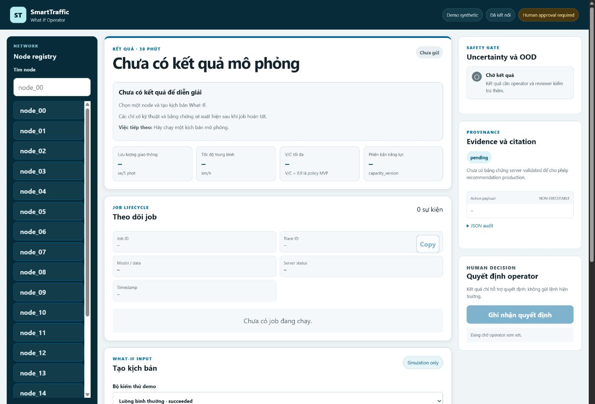
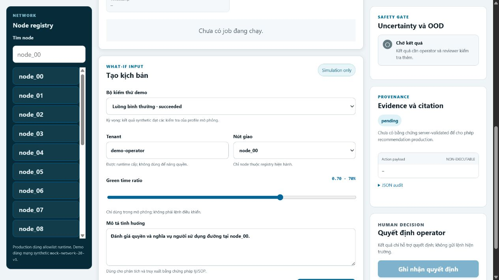
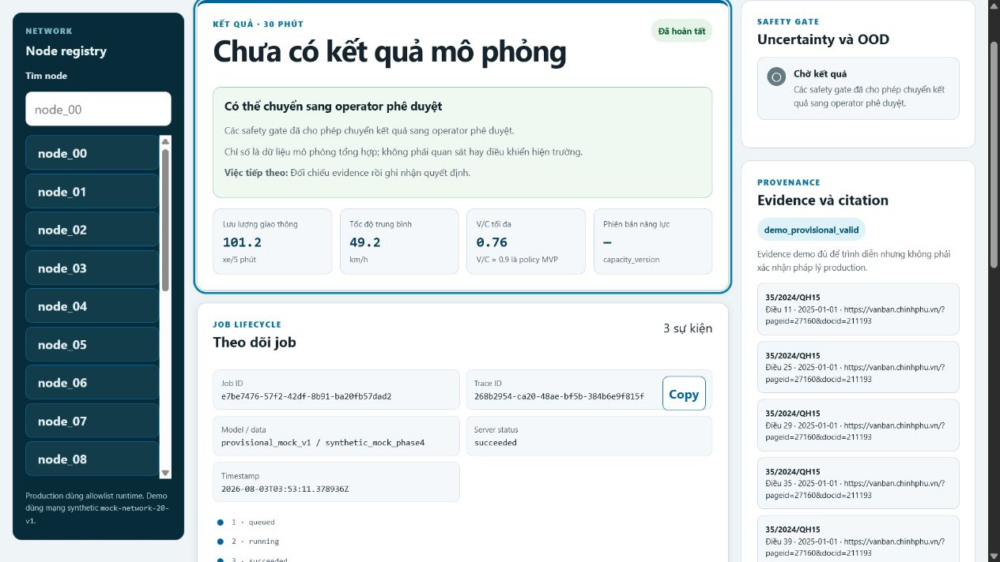
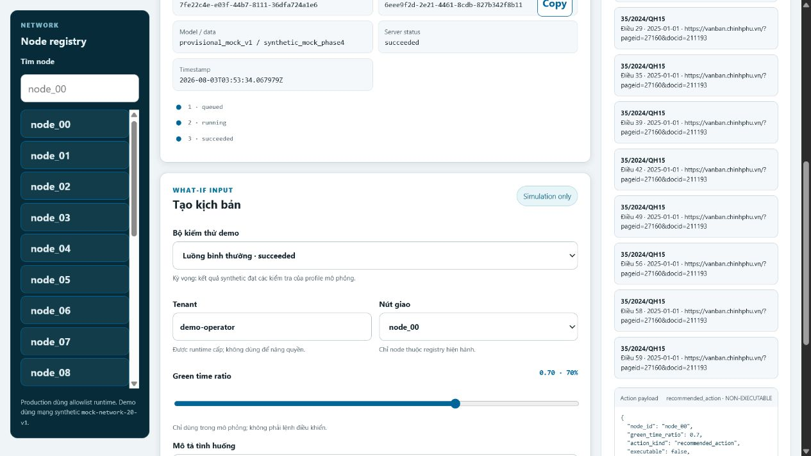
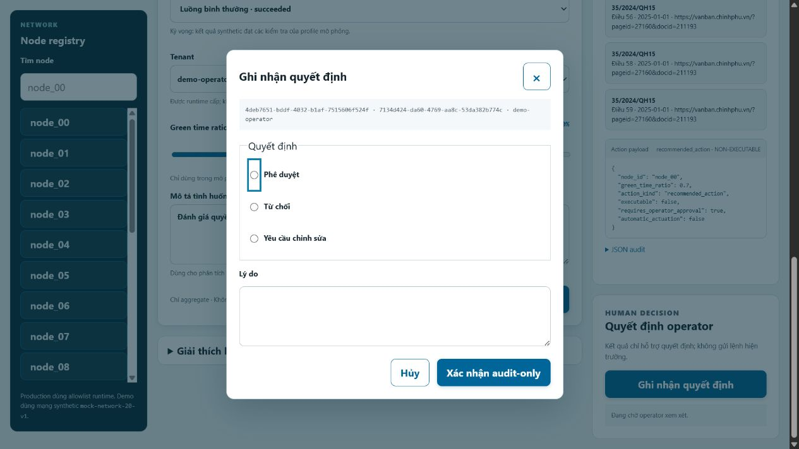
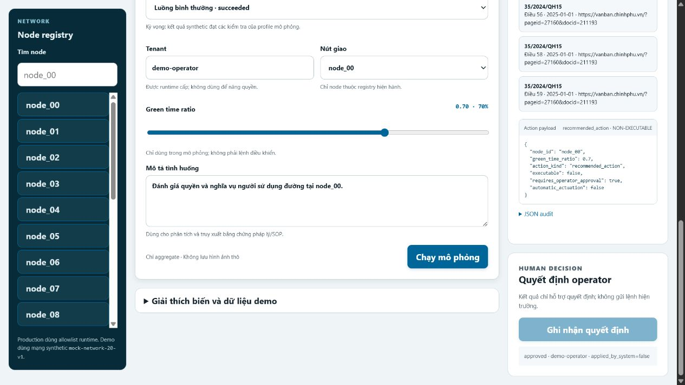
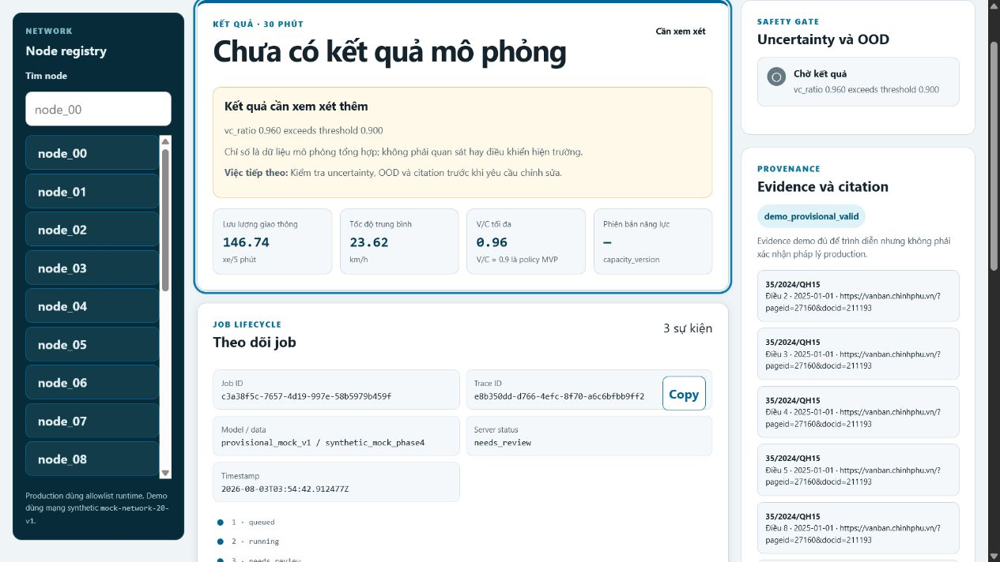
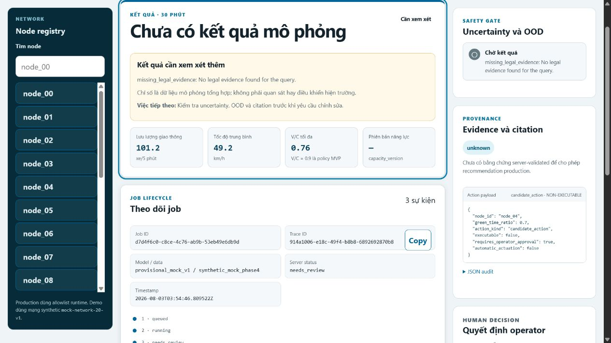
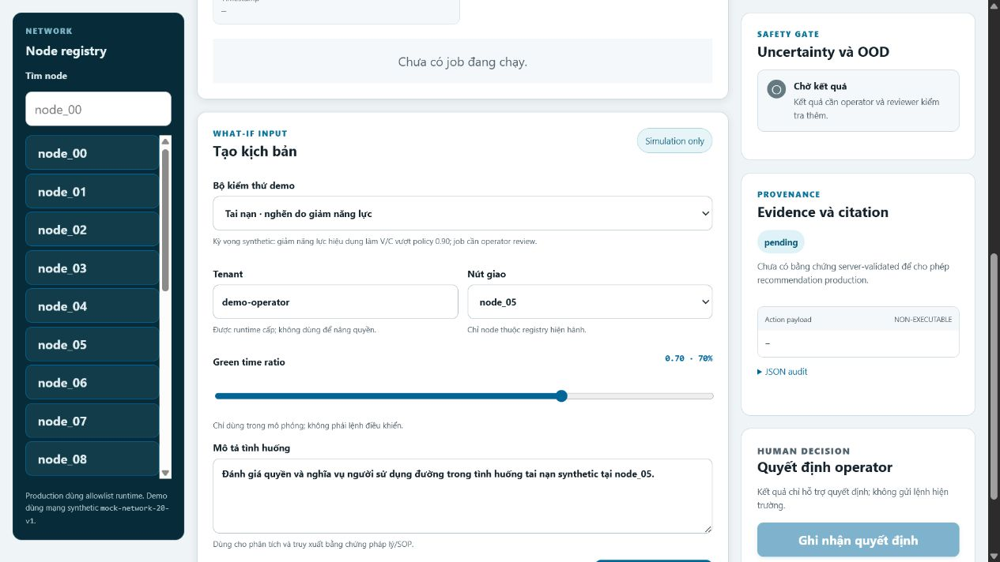
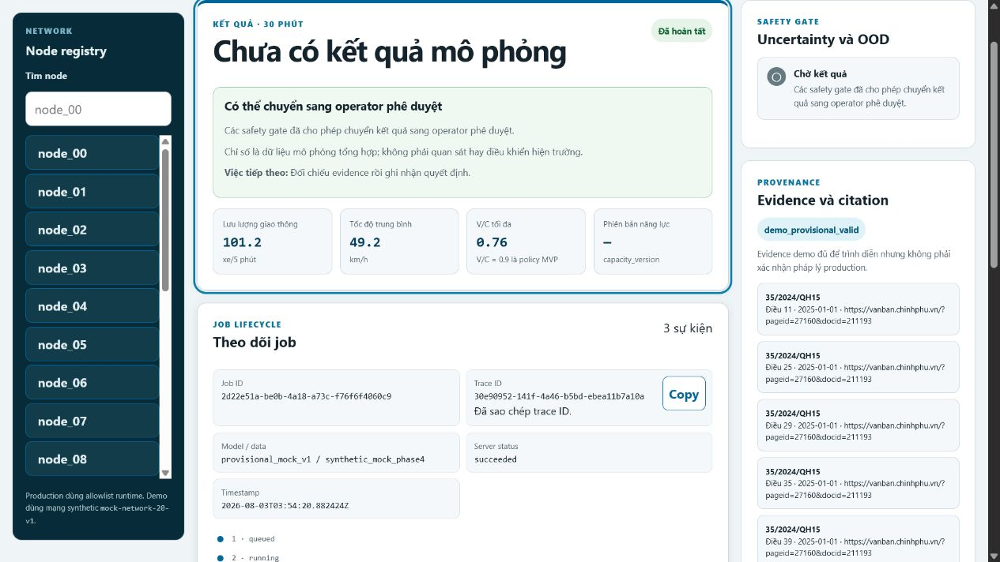

# Hướng dẫn sử dụng và demo STWI Operator Dashboard

Tài liệu này hướng dẫn sử dụng dashboard bằng các test case synthetic, deterministic. STWI chỉ hỗ trợ ra quyết định: hệ thống không gửi lệnh đến đèn tín hiệu hoặc thiết bị hiện trường, không lưu video thô và mọi action trong demo đều không thể thực thi tự động.

## 1. Phạm vi và điều kiện chuẩn bị

Bạn cần Python 3.11+ và PowerShell. Từ thư mục gốc repository, cài runtime và kiểm tra phạm vi demo:

```powershell
pip install -e ".[orchestrator]"
python scripts/validation/validate_demo_simulation_scope.py
python scripts/demo/run_mvp_smoke.py --output C:\tmp\stwi-mvp-demo-evidence.json
```

Khởi động dashboard chỉ trên loopback:

```powershell
$env:STWI_RUNTIME_MODE = "demo"
python -m uvicorn stwi.app:app --host 127.0.0.1 --port 8000
```

Mở `http://127.0.0.1:8000/demo/`. Không dùng file `index.html` trực tiếp vì chế độ `static_preview` không thể tạo job. Citation trong demo là bằng chứng provisional phục vụ kiểm thử, không phải xác nhận pháp lý production.

## 2. Nhận biết giao diện



Kiểm tra các vùng chính trước khi chạy:

- Thanh đầu trang hiển thị `Demo synthetic`, trạng thái kết nối và danh tính operator/tenant.
- Khối **Tạo kịch bản What-If** chứa preset, node và `green_time_ratio`.
- Khối **Kết quả 30 phút** hiển thị các số liệu có đơn vị; lifecycle chỉ dùng sáu trạng thái canonical: `queued`, `running`, `succeeded`, `needs_review`, `failed`, `expired`.
- Evidence rail hiển thị safety gate, uncertainty/OOD, citation, model/data version, `job_id` và `trace_id`.
- Decision gate chỉ ghi audit. Bản ghi luôn phải cho thấy `applied_by_system=false`.

## 3. Test case cơ sở: `safe` → `succeeded`

### Bước 1 — Chọn dữ liệu đầu vào

**Mục tiêu:** tạo một job synthetic vượt qua các gate demo.

**Dữ liệu chọn:** preset `safe`, node `node_00`, `green_time_ratio=0.70`, jurisdiction `VN`.



**Thao tác:** chọn preset `safe`, xác nhận các giá trị tự điền, rồi bấm **Chạy mô phỏng**.

**Kết quả mong đợi:** job lần lượt chuyển `queued`/`running` và kết thúc ở `succeeded`.

**Điểm kiểm tra:** nhãn **Simulation only** phải hiển thị; thao tác không làm thay đổi đèn thật.

### Bước 2 — Đọc kết quả



**Kết quả mong đợi:** màn hình hiển thị `traffic_volume_5m`, `avg_speed_kmh`, V/C, timestamp, job/trace ID và ngữ cảnh dự báo 30 phút.

**Điểm kiểm tra:** đơn vị phải đi cùng số liệu. V/C `0.9` là policy cấu hình của MVP, không phải ngưỡng do pháp luật quy định.

### Bước 3 — Kiểm tra bằng chứng và action



**Thao tác:** cuộn tới safety/evidence rail và mở phần citation/action nếu đang thu gọn.

**Kết quả mong đợi:** evidence ở trạng thái demo provisional; model/data version và citation có cấu trúc được hiển thị. Chỉ job `succeeded` mới có `recommended_action`.

**Điểm kiểm tra:** action phải mang nhãn `NON-EXECUTABLE`/`executable: false`; operator vẫn phải quyết định.

### Bước 4 — Ghi quyết định audit-only



**Thao tác:** bấm **Ghi nhận quyết định**, chọn một lựa chọn được policy cho phép, nhập lý do đã xem evidence rồi gửi.



**Kết quả mong đợi:** dashboard tải lại bản ghi quyết định từ job và hiển thị decision, operator, lý do cùng `applied_by_system=false`.

**Điểm kiểm tra:** đây là audit trail bất biến, không phải nút điều khiển hiện trường.

## 4. Test case fail-closed

Chạy lần lượt từng preset. Sau mỗi lần, chờ trạng thái terminal rồi đối chiếu bảng sau:

| Preset | Node | Trạng thái mong đợi | Quan sát bắt buộc |
|---|---|---|---|
| `unsafe-vc` | `node_01` | `needs_review` | V/C vượt policy `0.9`; không được approve. |
| `ood` | `node_02` | `needs_review` | OOD fail-closed; chỉ có `candidate_action`. |
| `uncertainty` | `node_03` | `needs_review` | Uncertainty cao; cần operator review. |
| `missing-evidence` | `node_04` | `needs_review` | Thiếu citation hợp lệ; không có recommendation. |
| `extreme` | `node_00` | `needs_review` | `green_time_ratio=0.00` bị safety gate giữ lại. |

### V/C không an toàn



Chọn `unsafe-vc` và chạy. Kết quả phải nêu V/C `0.96` vượt policy `0.90`, chuyển `needs_review` và chỉ hiển thị `candidate_action · NON-EXECUTABLE`.

### Ngoài phân phối (OOD)


Chọn `ood` và chạy. Lý do review phải nhận diện `out_of_distribution`; không được xuất `recommended_action` hay đường phê duyệt.

### Độ bất định cao


Chọn `uncertainty` và chạy. Dashboard phải giải thích uncertainty cao, giữ trạng thái `needs_review` và yêu cầu con người đánh giá.

### Thiếu bằng chứng hợp lệ



Chọn `missing-evidence` và chạy. Jurisdiction synthetic không có căn cứ trong corpus được phép phải fail closed; không được coi citation demo là xác nhận pháp lý production.

Với `extreme`, chọn preset và xác nhận tỷ lệ xanh bằng `0.00`. UI phải giữ job ở `needs_review`. Test case này dùng chung mẫu kiểm tra safety với bốn trường hợp trên nên không cần ảnh riêng.

## 5. Nhóm tình huống giao thông synthetic



Các preset dưới đây kiểm tra khả năng trình bày nghiệp vụ, không chứng minh quan hệ nhân quả hoặc độ chính xác ngoài thực địa:

| Preset | Node | Kết quả demo mong đợi | Số liệu tham chiếu deterministic |
|---|---|---|---|
| `accident` | `node_05` | `needs_review`, V/C vượt policy | volume `139.66`, speed `21.65 km/h`, V/C `0.95` |
| `flood` | `node_06` | `needs_review`, tốc độ thấp | volume `72.86`, speed `11.81 km/h`, V/C `0.99` |
| `lane-closure` | `node_07` | `needs_review`, năng lực hiệu dụng giảm | volume `119.42`, speed `26.57 km/h`, V/C `0.93` |
| `demand-surge` | `node_08` | `needs_review`, lưu lượng cao | volume `177.10`, speed `20.66 km/h`, V/C `0.98` |
| `environmental-anomaly` | `node_09` | `needs_review`, OOD | volume `106.26`, speed `35.42 km/h`, V/C `0.79` |

Thao tác cho mỗi hàng: chọn preset, kiểm tra node/tỷ lệ tự điền, bấm **Chạy mô phỏng**, chờ `needs_review`, rồi xác nhận chỉ có `candidate_action · NON-EXECUTABLE`.

Không diễn giải các preset này như dữ liệu tai nạn thật, phép đo mực nước, kết luận ô nhiễm gây ùn tắc hoặc khả năng điều khiển hiện trường.

## 6. Bàn phím và sao chép trace ID

- Nhấn `/` khi không ở trong ô nhập để đưa focus tới ô tìm node.
- Nhấn `C` khi không ở trong ô nhập để sao chép trace ID của job hiện tại.
- Dùng `Enter` để kích hoạt nút/control native đang focus.
- Dùng `Esc` để đóng decision dialog; focus phải quay lại control đã mở dialog.



Ảnh trên minh họa trường hợp browser cho phép clipboard và UI báo **Đã sao chép trace ID**. Nếu browser từ chối quyền, dashboard phải hiển thị hướng dẫn chọn trace ID và sao chép thủ công; lỗi quyền clipboard không được làm hỏng job hay tạo console error chưa xử lý.

## 7. Xử lý sự cố

| Hiện tượng | Cách xử lý |
|---|---|
| Hiển thị `Static preview` hoặc không tạo được job | Dừng việc mở file HTML trực tiếp; dùng URL `http://127.0.0.1:8000/demo/`. |
| `Connection refused` | Kiểm tra cửa sổ Uvicorn còn chạy và đúng cổng `8000`; không đổi sang host public. |
| Job kết thúc `needs_review` | Đọc review reason, safety/OOD/uncertainty và citation. Đây có thể là kết quả đúng của test fail-closed. |
| Clipboard bị chặn | Chọn trace ID và sao chép thủ công; không cần cấp thêm quyền để tiếp tục demo. |
| Job `failed` hoặc `expired` | Ghi lại `job_id`, `trace_id`, error code/timestamp; không tự chuyển thành `succeeded` hoặc bỏ qua gate. |
| Evidence không rõ hoặc thiếu citation | Không phê duyệt; giữ `needs_review` và chuyển reviewer phù hợp. |

## 8. Kết thúc phiên

1. Xác nhận action vẫn `NON-EXECUTABLE` và mọi quyết định đã ghi `applied_by_system=false`.
2. Ghi lại job/trace ID cần phục vụ audit; không lưu payload vượt nhu cầu.
3. Dừng Uvicorn bằng `Ctrl+C`.
4. Xóa evidence tạm nếu không cần review và xác nhận không có raw video, credential hoặc endpoint riêng được lưu/phát hành.
